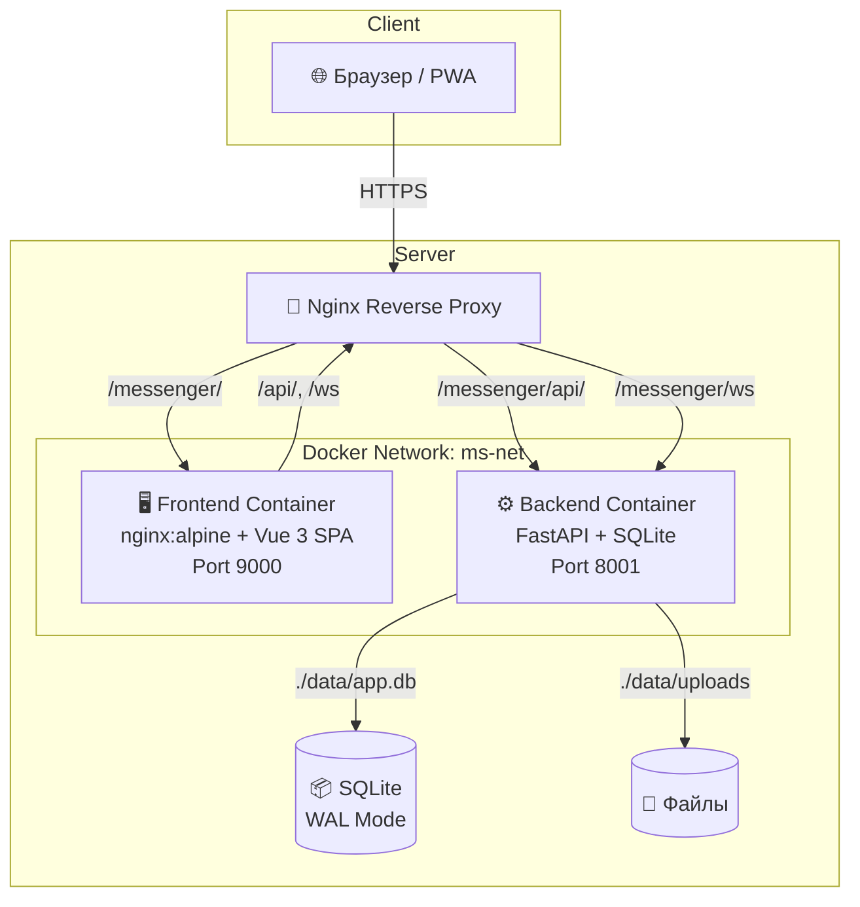
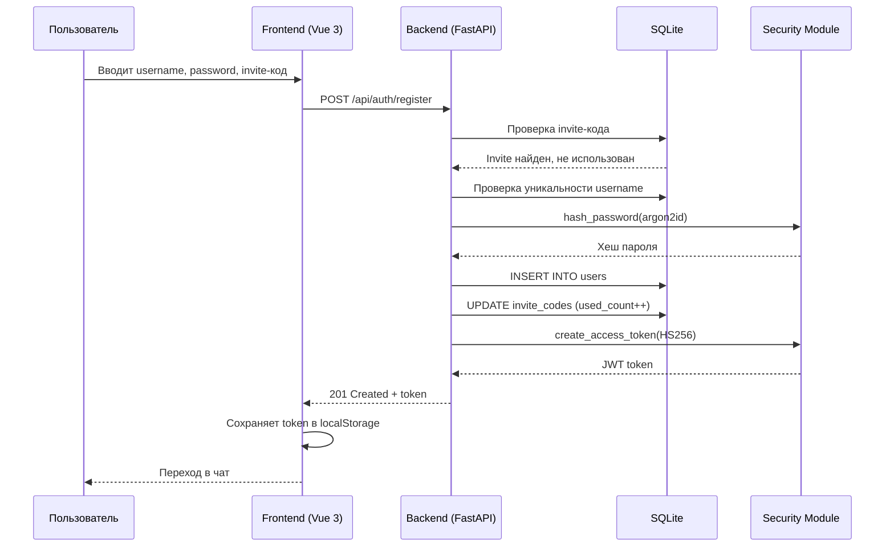
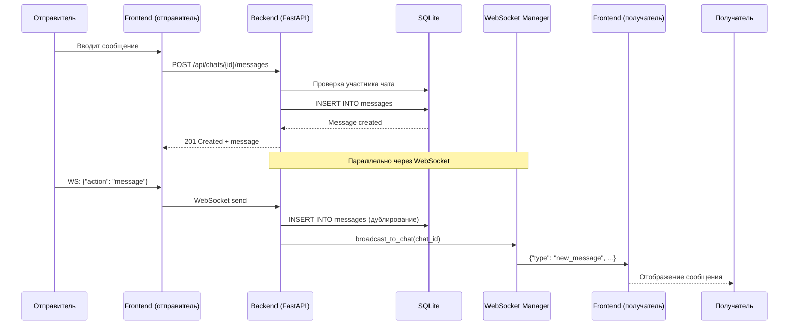

# Раздел 1: Введение

## 1.1. Назначение документа

Настоящий документ представляет собой полную техническую документацию проекта «Личный мессенджер» — self-hosted решения для приватной коммуникации.

**Целевая аудитория:**
- Разработчики, поддерживающие и расширяющие проект
- DevOps-инженеры, развёртывающие мессенджер на серверах
- Системные администраторы, обеспечивающие эксплуатацию и мониторинг

**Как пользоваться документацией:**
- Для быстрого старта читайте [Раздел 3: Настройка окружения](#раздел-3-настройка-окружения)
- Для понимания архитектуры — [Раздел 2: Архитектура системы](#раздел-2-архитектура-системы)
- Для интеграции через API — [Раздел 6: API-контракты](#раздел-6-api-контракты)
- Для устранения проблем — [Раздел 18: Troubleshooting](#раздел-18-руководство-по-устранению-проблем)

## 1.2. Обзор проекта

«Личный мессенджер» — это приватное веб-приложение для обмена сообщениями, предназначенное для личного использования или небольших команд. Все данные хранятся исключительно на сервере пользователя, без зависимости от внешних сервисов.

**Основные возможности (MVP):**

| Возможность | Описание |
|-------------|----------|
| Авторизация по invite-коду | Регистрация только по приглашению, полный контроль над доступом |
| Личные и групповые чаты | До 20 участников в групповом чате |
| Текст, эмодзи, файлы | Поддержка текста, эмодзи, фото и документов до 25 МБ |
| Статусы сообщений | Отправлено → Доставлено → Прочитано |
| Real-time коммуникация | Мгновенная доставка через WebSocket |
| Поиск по сообщениям | Полнотекстовый поиск по содержимому чатов |
| PWA | Установка на телефон как нативное приложение |
| Тёмная/светлая тема | Переключение оформления интерфейса |

## 1.3. Технологический стек

### Бэкенд

| Технология | Версия | Назначение |
|------------|--------|------------|
| Python | 3.12+ | Язык программирования |
| FastAPI | 0.115+ | Веб-фреймворк (REST + WebSocket) |
| SQLModel | 0.0.22+ | ORM и Pydantic-модели |
| SQLite + aiosqlite | — | База данных в WAL-режиме |
| Argon2-CFFI | 23.1+ | Хеширование паролей (argon2id) |
| python-jose | 3.3+ | JWT токены (HS256) |
| SlowAPI | 0.1.9+ | Rate limiting |
| Loguru | 0.7.2+ | Логирование |
| python-magic | 0.4.27+ | Валидация MIME-типов файлов |

### Фронтенд

| Технология | Версия | Назначение |
|------------|--------|------------|
| Vue 3 | 3.5+ | UI-фреймворк (Composition API) |
| Vite | 6.0+ | Сборщик и dev-сервер |
| Pinia | 2.2+ | State management |
| Vue Router | 4.4+ | Клиентский роутинг |
| vite-plugin-pwa | 0.21+ | Progressive Web App |

### Инфраструктура

| Технология | Назначение |
|------------|------------|
| Docker + Docker Compose | Контейнеризация и оркестрация |
| Nginx (Alpine) | Раздача статики, reverse proxy |
| Certbot + Let's Encrypt | SSL/TLS сертификаты |

## 1.4. Термины и сокращения

| Термин | Расшифровка | Описание |
|--------|-------------|----------|
| JWT | JSON Web Token | Стандарт аутентификации (RFC 7519) |
| PWA | Progressive Web App | Веб-приложение с возможностями нативного |
| WAL | Write-Ahead Logging | Режим журналирования SQLite для конкурентности |
| MIME | Multipurpose Internet Mail Extensions | Стандарт идентификации типов файлов |
| CORS | Cross-Origin Resource Sharing | Механизм разрешения кросс-доменных запросов |
| WebSocket | — | Протокол полнодуплексной связи поверх TCP |
| SPA | Single Page Application | Одностраничное веб-приложение |
| ORM | Object-Relational Mapping | Отображение объектов на таблицы БД |
| HTTPS | HTTP Secure | HTTP поверх TLS-шифрования |
| VPS | Virtual Private Server | Виртуальный выделенный сервер |

---

# Раздел 2: Архитектура системы

## 2.1. Общая архитектура

Мессенджер построен по **двухзвенной клиент-серверной архитектуре** с разделением frontend и backend в отдельные Docker-контейнеры:



**Поток запросов:**
1. Браузер подключается к Nginx по HTTPS
2. Статика и SPA-роутинг → Frontend контейнер (nginx:alpine)
3. API-запросы (`/messenger/api/*`) → Backend контейнер (FastAPI)
4. WebSocket (`/messenger/ws`) → Backend контейнер с upgrade до WS
5. Backend хранит данные в SQLite и файлы в файловой системе

## 2.2. Архитектурные решения

### Почему двухзвенная архитектура?

| Критерий | Решение | Обоснование |
|----------|---------|-------------|
| Frontend/Backend разделение | ✅ | Независимый деплой, разные технологии |
| Микросервисы | ❌ | Избыточно для self-hosted, один пользователь |
| Монолит на бэкенде | ✅ | Простота, производительность, лёгкая поддержка |
| SQLite вместо PostgreSQL | ✅ | Один писатель, WAL-режим, нет нужды в отдельном сервере БД |

### Trade-offs

**Преимущества:**
- Простота развёртывания — один `docker compose up`
- Нет внешних зависимостей (кроме Docker)
- Минимальные требования к серверу (512 МБ RAM)
- Полный контроль над данными

**Ограничения:**
- SQLite: один писатель, нет горизонтального масштабирования бэкенда
- In-memory WebSocket менеджер: при рестарте все подключения теряются
- Лимит 20 участников в чате (MVP)
- Нет шардирования или репликации БД

## 2.3. Структура проекта

```
messenger/
├── messenger/                    # Backend-приложение (Python)
│   ├── __init__.py
│   ├── main.py                   # Точка входа FastAPI, middleware, lifespan
│   ├── config.py                 # Pydantic-settings, загрузка .env
│   ├── database.py               # SQLite engine, сессии, инициализация
│   ├── api/                      # REST роутеры
│   │   ├── auth.py               # /api/auth/* — логин, регистрация, профиль
│   │   ├── chat.py               # /api/chats/* — CRUD чатов, сообщений
│   │   ├── files.py              # /api/files/* — загрузка/скачивание
│   │   └── users.py              # /api/users/* — поиск пользователей
│   ├── models/                   # SQLModel модели (таблицы БД)
│   │   ├── user.py               # Таблица users
│   │   ├── chat.py               # Таблица chats
│   │   ├── chat_member.py        # Таблица chat_members
│   │   ├── message.py            # Таблица messages
│   │   └── invite_code.py        # Таблица invite_codes
│   ├── schemas/                  # Pydantic схемы (request/response)
│   │   ├── auth.py               # Схемы аутентификации
│   │   └── chat.py               # Схемы чатов и сообщений
│   ├── security/                 # Модули безопасности
│   │   └── auth.py               # JWT, argon2, invite-коды
│   ├── websockets/               # WebSocket обработчики
│   │   ├── manager.py            # ConnectionManager — управление подключениями
│   │   └── handler.py            # WebSocket endpoint и обработчики действий
│   └── utils/                    # Утилиты
├── frontend/                     # Frontend-приложение (Vue 3)
│   ├── src/
│   │   ├── App.vue               # Корневой компонент
│   │   ├── router.js             # Vue Router маршруты
│   │   ├── stores/               # Pinia stores
│   │   │   ├── auth.js           # Состояние аутентификации
│   │   │   └── chat.js           # Состояние чатов и сообщений
│   │   └── views/
│   │       ├── AuthView.vue      # Страница логина/регистрации
│   │       └── ChatView.vue      # Основной интерфейс чата
│   ├── vite.config.js            # Конфигурация Vite + PWA
│   ├── package.json              # Зависимости npm
│   ├── Dockerfile                # Multi-stage: node → nginx:alpine
│   └── nginx.conf                # Nginx для раздачи статики
├── tests/                        # Тесты (pytest)
│   ├── conftest.py               # Фикстуры и конфигурация
│   ├── test_auth.py              # Тесты аутентификации
│   ├── test_chat_api.py          # Тесты чатов
│   ├── test_users.py             # Тесты поиска пользователей
│   ├── test_security.py          # Тесты безопасности
│   ├── test_models.py            # Тесты моделей
│   └── test_health.py            # Тесты health check
├── scripts/                      # Скрипты развёртывания
│   ├── deploy.sh                 # Основной скрипт деплоя
│   ├── backup.sh                 # Создание бэкапа БД
│   ├── restore.sh                # Восстановление из бэкапа
│   └── init.sh                   # Инициализация (первый invite-код)
├── docker-compose.yml            # Оркестрация контейнеров
├── Dockerfile                    # Backend Dockerfile (multi-stage)
├── Makefile                      # Команды управления проектом
├── pyproject.toml                # Python зависимости (Poetry)
├── .pre-commit-config.yaml       # Pre-commit hooks
└── .env.example                  # Шаблон переменных окружения
```

## 2.4. Поток данных

### Сценарий: Регистрация пользователя



### Сценарий: Отправка сообщения (REST + WebSocket)



## 2.5. Масштабируемость и ограничения

### Текущие ограничения

| Параметр | Лимит | Обоснование |
|----------|-------|-------------|
| Участники в чате | 20 | MVP, personal messenger |
| Размер файла | 25 МБ | Ограничение хранилища, SQLite |
| Rate limit | 5 запросов/сек на IP | Защита от brute-force |
| JWT expiration | 7 дней | Баланс удобства и безопасности |
| Длина сообщения | 10 000 символов | Защита от abuse |
| Поиск | LIKE query | SQLite full-text search не включён |

### Пути масштабирования

| Компонент | Текущее состояние | Путь масштабирования |
|-----------|-------------------|----------------------|
| БД | SQLite (один файл) | → PostgreSQL с репликацией |
| WebSocket | In-memory manager | → Redis Pub/Sub для горизонтального масштабирования |
| Файлы | Локальная ФС | → S3-compatible хранилище |
| Бэкенд | 1 контейнер | → Несколько реплик за load balancer |
| Кэширование | Отсутствует | → Redis для кэширования сессий и сообщений |
