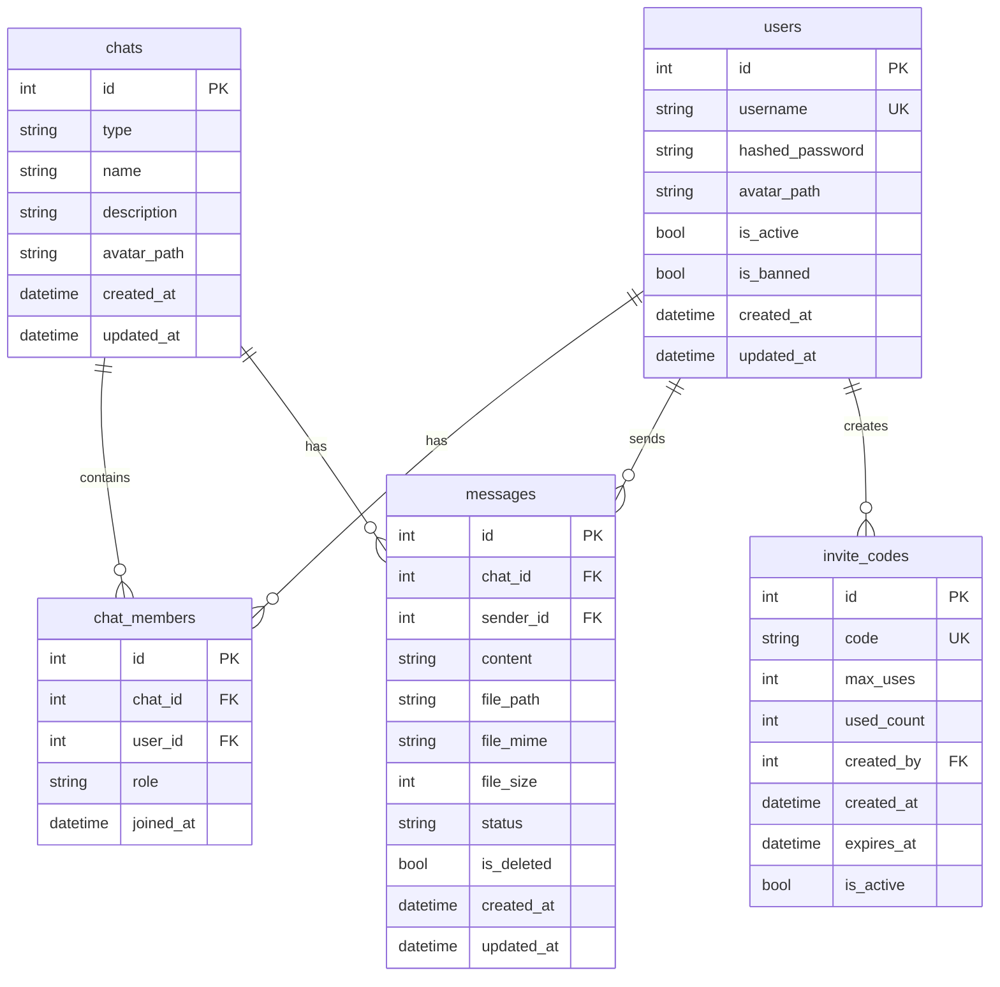

# Раздел 3: Настройка окружения

## 3.1. Системные требования

### Минимальные требования

| Ресурс | Значение | Примечание |
|--------|----------|------------|
| CPU | 1 ядро | Backend ограничен 1.0 CPU в Docker |
| RAM | 512 МБ | Лимит Docker для backend |
| Диск | 1 ГБ | БД + файлы + логи |
| ОС | Linux (x86_64) | Docker совместимый |

### Рекомендуемые требования

| Ресурс | Значение | Примечание |
|--------|----------|------------|
| CPU | 2 ядра | Для комфортной работы |
| RAM | 1 ГБ | С запасом для роста |
| Диск | 10 ГБ | Для хранения файлов и бэкапов |
| Сеть | 10 Мбит/с | Для real-time коммуникации |

### Зависимости

| Компонент | Версия | Установка (Ubuntu/Debian) |
|-----------|--------|---------------------------|
| Docker | 24.0+ | `apt-get install docker.io` |
| Docker Compose | V2 (2.20+) | Входит в Docker Desktop / `docker-compose-plugin` |
| Git | 2.40+ | `apt-get install git` |
| Make | 4.0+ | `apt-get install make` |
| Python (dev) | 3.12+ | `apt-get install python3.12 python3-pip` |
| Poetry (dev) | 1.8+ | `pip install poetry` |
| Node.js (dev) | 20+ | `curl -fsSL https://deb.nodesource.com/setup_20.x \| bash -` |

## 3.2. Установка зависимостей

### Production сервер

```bash
# Установка Docker
curl -fsSL https://get.docker.com | sh

# Проверка установки
docker --version
docker compose version
```

### Разработка (локальная машина)

```bash
# Установка Python зависимостей
make install

# Установка pre-commit hooks
make hooks

# Установка frontend зависимостей
cd frontend && npm install && cd ..
```

## 3.3. Клонирование репозитория

```bash
git clone <repo-url> messenger
cd messenger
```

## 3.4. Конфигурация .env

Скопируйте шаблон и отредактируйте:

```bash
cp .env.example .env
```

### Полная таблица переменных

| Переменная | Тип | По умолчанию | Описание | Обязательно |
|------------|-----|--------------|----------|-------------|
| `APP_NAME` | string | `Messenger` | Название приложения | Нет |
| `DEBUG` | bool | `false` | Режим отладки | Нет |
| `LOG_LEVEL` | string | `INFO` | Уровень логирования (DEBUG, INFO, WARNING, ERROR) | Нет |
| `DATABASE_URL` | string | `sqlite+aiosqlite:///./data/app.db` | URL подключения к БД | Нет |
| `JWT_SECRET_KEY` | string | `change-me-in-production` | Секретный ключ JWT | **Да** |
| `JWT_ALGORITHM` | string | `HS256` | Алгоритм JWT | Нет |
| `JWT_EXPIRE_MINUTES` | int | `10080` (7 дней) | Время жизни токена | Нет |
| `UPLOAD_DIR` | string | `./data/uploads` | Директория для файлов | Нет |
| `MAX_FILE_SIZE_MB` | int | `25` | Максимальный размер файла | Нет |
| `INVITE_CODE_LENGTH` | int | `8` | Длина invite-кода | Нет |
| `INVITE_CODE_MAX_USES` | int | `1` | Максимум использований кода | Нет |
| `RATE_LIMIT_REQUESTS` | int | `5` | Запросов в rate limit window | Нет |
| `RATE_LIMIT_SECONDS` | int | `1` | Длительность window (сек) | Нет |
| `CORS_ORIGINS` | string | `http://localhost,http://localhost:5173` | CORS origins через запятую | Нет |
| `ADMIN_INVITE_CODE` | string | `ADMIN-SETUP-CODE` | Код для первого входа | Нет |
| `MESSENGER_DOMAIN` | string | `YOUR_DOMAIN_HERE` | Домен для SSL | Production |
| `MESSENGER_EMAIL` | string | `YOUR_EMAIL_HERE` | Email для Let's Encrypt | Production |

### Генерация секретов

```bash
# JWT_SECRET_KEY
python3 -c "import secrets; print(secrets.token_urlsafe(32))"

# Или через openssl
openssl rand -base64 32
```

## 3.5. Локальный запуск (разработка)

```bash
# Запуск всех сервисов
make up

# Или напрямую через Docker Compose
docker compose up -d --build
```

**Dev-сервер фронтенда** (с hot-reload):

```bash
cd frontend
npm run dev
# Сервер запустится на http://localhost:5173
# API проксируется на http://localhost:8000
```

**Backend напрямую** (без Docker):

```bash
make install
uvicorn messenger.main:app --reload --host 0.0.0.0 --port 8000
```

## 3.6. Production развёртывание

### Подготовка VPS

1. Купите домен и направьте A-запись на IP сервера
2. Установите Docker (см. 3.2)
3. Откройте порты: 80 (HTTP), 443 (HTTPS)

### Деплой

```bash
# Клонирование
git clone <repo-url> /opt/messenger
cd /opt/messenger

# Настройка .env
cp .env.example .env
# Отредактируйте: JWT_SECRET_KEY, MESSENGER_DOMAIN, MESSENGER_EMAIL

# Запуск деплоя
sudo MESSENGER_DOMAIN=your-domain.com \
     MESSENGER_EMAIL=your@email.com \
     bash scripts/deploy.sh
```

Подробности — [Раздел 13: Процесс деплоя](#раздел-13-процесс-деплоя).

## 3.7. Troubleshooting окружения

| Проблема | Решение |
|----------|---------|
| `JWT_SECRET_KEY must be changed` | Сгенерируйте новый ключ, см. 3.4 |
| Port already in use | Проверьте: `sudo lsof -i :8001` |
| Permission denied на data/ | `chmod -R 777 ./data` |
| Docker Compose not found | Установите: `apt install docker-compose-plugin` |
| SQLite locked | Остановите приложение, удалите `data/app.db-wal`, перезапустите |

---

# Раздел 4: База данных

## 4.1. Обзор БД

Мессенджер использует **SQLite** — встраиваемую реляционную базу данных. Это осознанный выбор для self-hosted сценария:

**Преимущества SQLite:**
- Zero configuration — не нужен отдельный сервер
- Один файл — легко бэкапить и переносить
- Высокая производительность для read-heavy workload
- ACID-совместимость
- Нет дополнительных зависимостей в Docker

**Ограничения:**
- Один писатель (write serialisation)
- Нет встроенной репликации
- Ограниченная конкурентность записи

## 4.2. WAL режим

Write-Ahead Logging (WAL) — режим журналирования, обеспечивающий:

- **Конкурентность:** читатели не блокируют писателей и наоборот
- **Производительность:** меньше I/O операций
- **Безопасность:** атомарные транзакции

### PRAGMA настройки

```sql
-- Включение WAL режима
PRAGMA journal_mode=WAL;

-- Нормальная синхронизация (баланс скорости и безопасности)
PRAGMA synchronous=NORMAL;

-- Включение внешних ключей
PRAGMA foreign_keys=ON;
```

Эти настройки применяются при инициализации в [`database.py`](messenger/database.py:39):

```python
async with aiosqlite.connect(str(DB_FILE)) as db:
    await db.execute("PRAGMA journal_mode=WAL;")
    await db.execute("PRAGMA synchronous=NORMAL;")
    await db.execute("PRAGMA foreign_keys=ON;")
    await db.commit()
```

## 4.3. Схема данных



## 4.4. Модели данных (SQLModel)

### 4.4.1. User ([`user.py`](messenger/models/user.py))

| Поле | Тип | Ограничения | Описание |
|------|-----|-------------|----------|
| `id` | int | PK, auto | Уникальный идентификатор |
| `username` | str | unique, index, 2-50 chars | Логин пользователя |
| `hashed_password` | str | min 8 chars | Argon2id хеш |
| `avatar_path` | str\|None | max 500 chars | Путь к аватару |
| `is_active` | bool | default=True | Аккаунт активен |
| `is_banned` | bool | default=False | Забанен |
| `created_at` | datetime | auto | Дата создания |
| `updated_at` | datetime | auto | Дата обновления |

### 4.4.2. Chat ([`chat.py`](messenger/models/chat.py))

| Поле | Тип | Ограничения | Описание |
|------|-----|-------------|----------|
| `id` | int | PK, auto | Уникальный идентификатор |
| `type` | ChatType | enum: personal, group | Тип чата |
| `name` | str\|None | max 200 chars | Название (для групп) |
| `description` | str\|None | max 1000 chars | Описание |
| `avatar_path` | str\|None | max 500 chars | Путь к аватару чата |
| `created_at` | datetime | auto | Дата создания |
| `updated_at` | datetime | auto | Дата последнего сообщения |

### 4.4.3. ChatMember ([`chat_member.py`](messenger/models/chat_member.py))

| Поле | Тип | Ограничения | Описание |
|------|-----|-------------|----------|
| `id` | int | PK, auto | Уникальный идентификатор |
| `chat_id` | int | FK → chats.id | Ссылка на чат |
| `user_id` | int | FK → users.id | Ссылка на пользователя |
| `role` | MemberRole | enum: admin, member | Роль в чате |
| `joined_at` | datetime | auto | Дата вступления |

### 4.4.4. Message ([`message.py`](messenger/models/message.py))

| Поле | Тип | Ограничения | Описание |
|------|-----|-------------|----------|
| `id` | int | PK, auto | Уникальный идентификатор |
| `chat_id` | int | FK → chats.id, index | Ссылка на чат |
| `sender_id` | int | FK → users.id, index | Автор сообщения |
| `content` | str\|None | max 10000 chars | Текст сообщения |
| `file_path` | str\|None | max 500 chars | Путь к файлу |
| `file_mime` | str\|None | max 100 chars | MIME-тип файла |
| `file_size` | int\|None | — | Размер в байтах |
| `status` | MessageStatus | enum: sent, delivered, read | Статус доставки |
| `is_deleted` | bool | default=False | Soft-delete флаг |
| `created_at` | datetime | auto | Время отправки |
| `updated_at` | datetime | auto | Время обновления |

### 4.4.5. InviteCode ([`invite_code.py`](messenger/models/invite_code.py))

| Поле | Тип | Ограничения | Описание |
|------|-----|-------------|----------|
| `id` | int | PK, auto | Уникальный идентификатор |
| `code` | str | unique, index, max 50 | Код приглашения |
| `max_uses` | int | default=1 | Максимум использований |
| `used_count` | int | default=0 | Текущий счётчик |
| `created_by` | int\|None | FK → users.id | Кто создал |
| `created_at` | datetime | auto | Дата создания |
| `expires_at` | datetime\|None | — | Срок действия |
| `is_active` | bool | default=True | Активен ли |

## 4.5. Инициализация БД

Процесс инициализации ([`init_db()`](messenger/database.py:34)):

1. Создание директории `./data/`
2. Подключение к SQLite через aiosqlite
3. Применение PRAGMA настроек (WAL, synchronous, foreign_keys)
4. Создание всех таблиц через `SQLModel.metadata.create_all`

```python
async def init_db() -> None:
    DB_DIR.mkdir(parents=True, exist_ok=True)
    
    # WAL режим
    async with aiosqlite.connect(str(DB_FILE)) as db:
        await db.execute("PRAGMA journal_mode=WAL;")
        await db.execute("PRAGMA synchronous=NORMAL;")
        await db.execute("PRAGMA foreign_keys=ON;")
        await db.commit()
    
    # Создание таблиц
    engine = get_engine()
    async with engine.begin() as conn:
        await conn.run_sync(SQLModel.metadata.create_all)
```

## 4.6. Сессии и транзакции

### Получение сессии ([`get_session()`](messenger/database.py:51))

```python
async def get_session() -> AsyncGenerator[AsyncSession, None]:
    engine = get_engine()
    async with AsyncSession(engine) as session:
        try:
            yield session
        except Exception:
            await session.rollback()
            raise
```

**Паттерн:**
- Сессия создаётся на каждый запрос (FastAPI dependency)
- При исключении — автоматический rollback
- При успешном завершении — commit в роутере

### Connection pooling

SQLite не поддерживает настоящий connection pool. Используется `pool_pre_ping=True` для проверки соединения перед использованием.

## 4.7. Миграции

Проект включает **Alembic** в зависимости (`pyproject.toml`), но на текущий момент миграции не настроены. Таблицы создаются через `SQLModel.metadata.create_all`.

**Рекомендуемый подход для production:**

```bash
# Инициализация Alembic
alembic init -t async alembic

# Создание миграции
alembic revision --autogenerate -m "initial schema"

# Применение миграции
alembic upgrade head
```

## 4.8. Производительность

### Индексы

| Таблица | Поле | Тип | Назначение |
|---------|------|-----|------------|
| users | username | unique, B-tree | Быстрый поиск по нику |
| chats | — | — | Маленькая таблица |
| chat_members | chat_id | B-tree | Поиск участников чата |
| chat_members | user_id | B-tree | Поиск чатов пользователя |
| messages | chat_id | B-tree | Сообщения конкретного чата |
| messages | sender_id | B-tree | Сообщения пользователя |
| invite_codes | code | unique, B-tree | Быстрая проверка кода |

### Оптимизация запросов

- **Пагинация:** `LIMIT/OFFSET` для сообщений (50 на страницу)
- **LIKE поиск:** Экранирование спецсимволов, лимит 50 результатов
- **Подсчёт участников:** `COUNT()` отдельным запросом
