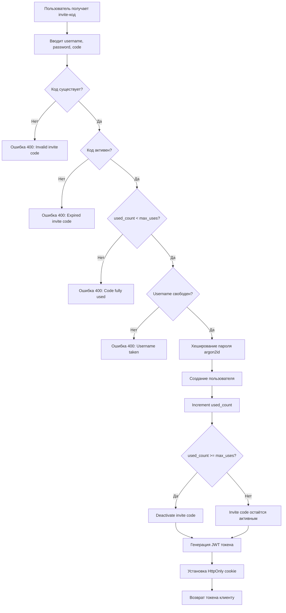
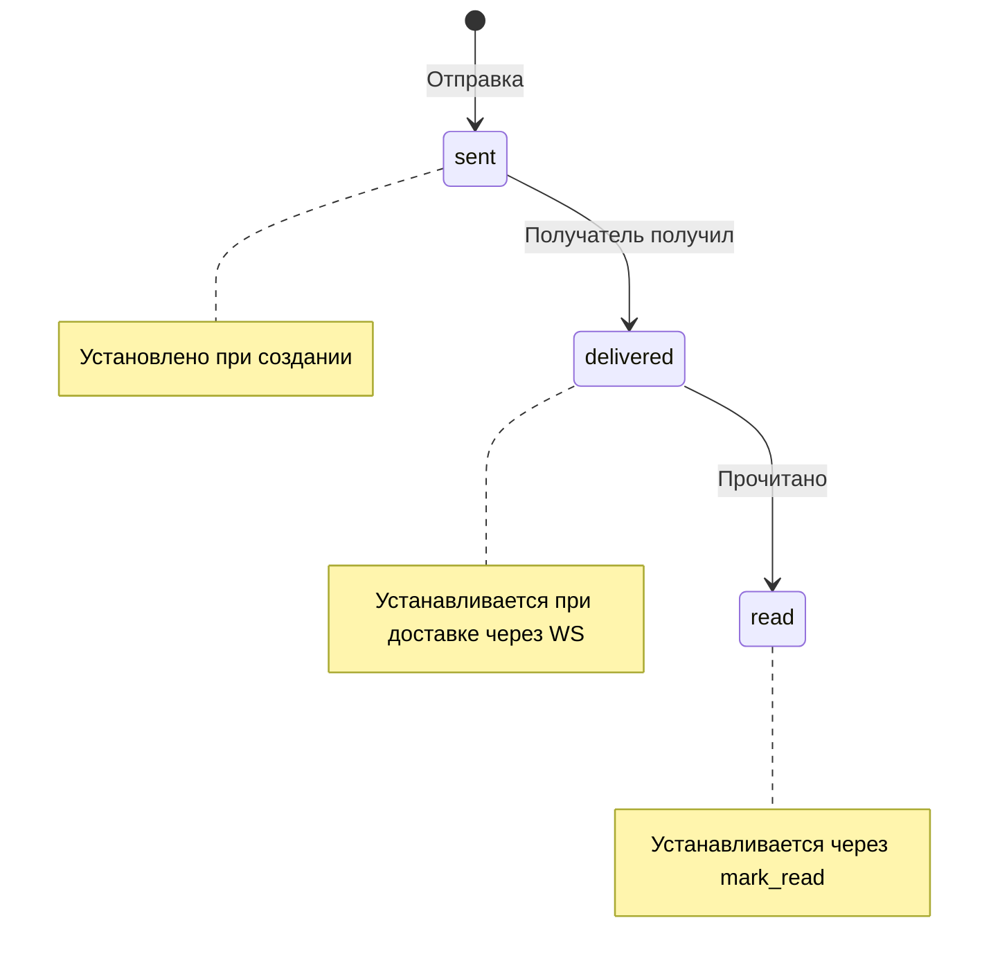

# Раздел 7: Бизнес-логика

## 7.1. Система аутентификации

### Flow регистрации по invite-коду



### JWT token lifecycle

1. **Создание:** [`create_access_token()`](messenger/security/auth.py:28)
   - Payload: `{"sub": "<user_id>", "exp": <timestamp>}`
   - `sub` конвертируется в строку (требование python-jose)
   - Алгоритм: HS256

2. **Хранение:** HttpOnly cookie
   - `httponly=True` — недоступен для JavaScript
   - `secure=not settings.debug` — только HTTPS в production
   - `samesite="lax"` — защита от CSRF
   - `max_age=jwt_expire_minutes * 60`

3. **Валидация:** [`get_current_user()`](messenger/api/auth.py:31)
   - Извлечение из cookie или `Authorization: Bearer` header
   - Декодирование через [`decode_access_token()`](messenger/security/auth.py:41)
   - Проверка существования и активности пользователя
   - Проверка бана

4. **Истечение:**
   - По умолчанию: 7 дней (10080 минут)
   - После истечения — 401 Unauthorized
   - Refresh токенов не реализован (MVP)

### Поддержка Authorization header

Для тестирования и API-клиентов:

```python
if not token and authorization and authorization.startswith("Bearer "):
    token = authorization.split(" ", 1)[1]
```

## 7.2. Invite-коды

### Генерация

```python
def generate_invite_code() -> str:
    alphabet = string.ascii_uppercase + string.digits  # A-Z, 0-9
    return "".join(secrets.choice(alphabet) for _ in range(settings.invite_code_length))
```

**Параметры по умолчанию:**
- Длина: 8 символов
- Алфавит: 36 символов (26 букв + 10 цифр)
- Энтропия: log₂(36⁸) ≈ 41.4 бит

### Валидация

```python
if invite is None or not invite.is_active:
    raise HTTPException(400, "Invalid or expired invite code")

if invite.used_count >= invite.max_uses:
    raise HTTPException(400, "Invite code has been fully used")
```

### Ограничения

| Поле | Описание | Default |
|------|----------|---------|
| `max_uses` | Максимум использований | 1 |
| `used_count` | Текущий счётчик | 0 |
| `expires_at` | Срок действия (nullable) | None (бессрочно) |
| `is_active` | Флаг активности | True |
| `created_by` | Автор кода (nullable) | None |

### Админ-код для первого входа

Переменная `ADMIN_INVITE_CODE` в `.env` — статический код для начальной настройки. Не хранится в БД, проверяется отдельно (скрипт `init.sh`).

## 7.3. Управление чатами

### Создание чата

```python
async def create_chat(data: ChatCreate, current_user: User, session) -> ChatResponse:
    chat = Chat(type=data.type, name=data.name, description=data.description)
    session.add(chat)
    await session.flush()
    
    # Создатель — админ
    admin_member = ChatMember(chat_id=chat.id, user_id=current_user.id, role=MemberRole.admin)
    session.add(admin_member)
    
    # Добавление участников
    for member_id in data.member_ids:
        if member_id == current_user.id:
            continue
        member = ChatMember(chat_id=chat.id, user_id=member_id, role=MemberRole.member)
        session.add(member)
    
    await session.commit()
```

### Роли и права

| Действие | Admin | Member |
|----------|-------|--------|
| Просмотр чата | ✅ | ✅ |
| Отправка сообщений | ✅ | ✅ |
| Добавление участников | ✅ | ❌ |
| Удаление участников | ✅ | ✅ (только себя) |
| Смена ролей | ✅ | ❌ |
| Удаление чата | ✅ | ❌ |
| Удаление сообщений | ✅ (любых) | ✅ (только своих) |

### Удаление чата

Каскадное удаление:
1. Все сообщения чата
2. Все участники чата
3. Сам чат

```python
for msg in messages_result.all():
    await session.delete(msg)
for member in members_result.all():
    await session.delete(member)
await session.delete(chat)
await session.commit()
```

## 7.4. Сообщения

### Статусы сообщений



| Статус | Описание | Когда устанавливается |
|--------|----------|----------------------|
| `sent` | Отправлено | При создании сообщения |
| `delivered` | Доставлено | Когда получатель подключён через WS |
| `read` | Прочитано | При вызове `mark_read` |

### Soft-delete

Сообщения не удаляются физически — устанавливается флаг `is_deleted = True`:

```python
message.is_deleted = True
await session.commit()
```

Все запросы к сообщениям фильтруют удалённые:
```python
Message.is_deleted == False
```

### Поиск сообщений

LIKE-поиск с экранированием спецсимволов:

```python
escaped_q = q.replace("\\", "\\\\").replace("%", "\\%").replace("_", "\\_")
Message.content.like(f"%{escaped_q}%")
```

**Ограничения:**
- Минимум 1 символ, максимум 200
- Лимит результатов: 50
- Без full-text search (SQLite FTS не включён)

### Пагинация

```python
offset = (page - 1) * per_page
# ORDER BY created_at DESC
# OFFSET offset LIMIT per_page
```

**Параметры:**
- `page`: ≥ 1
- `per_page`: 1-100 (default: 50)
- `has_next`: `(page * per_page) < total`

## 7.5. Файловая система

### Загрузка файлов

**Проверки:**
1. Доступ к чату (участник)
2. Размер файла (≤ 25 МБ)
3. Не пустой файл
4. MIME-тип через python-magic

```python
mime = magic.Magic(mime=True)
file_mime = mime.from_buffer(content)

if file_mime not in settings.allowed_mime_types:
    raise HTTPException(400, f"File type '{file_mime}' is not allowed")
```

### Разрешённые MIME-типы

| Тип | MIME | Описание |
|-----|------|----------|
| JPEG | image/jpeg | Фотографии |
| PNG | image/png | Изображения |
| GIF | image/gif | Анимации |
| WebP | image/webp | Современные изображения |
| PDF | application/pdf | Документы |
| ZIP | application/zip | Архивы |
| TXT | text/plain | Текстовые файлы |
| DOC | application/msword | Word документы |
| DOCX | application/vnd.openxmlformats... | Word (новый формат) |

### Хранение файлов

```
data/uploads/
├── {chat_id}/
│   ├── {uuid}.{ext}
│   └── {uuid}.{ext}
└── {chat_id}/
    └── {uuid}.{ext}
```

**Безопасное имя:**
- Санитизация: только alphanumeric, пробелы, точки, дефисы, подчёркивания
- UUID для уникальности: `uuid.uuid4().hex`
- Path traversal prevention при скачивании:

```python
upload_base = Path(settings.upload_dir).resolve()
full_path = (upload_base / file_path).resolve()

if not str(full_path).startswith(str(upload_base)):
    raise HTTPException(403, "Access denied")
```

---

# Раздел 8: Безопасность и шифрование

## 8.1. Обзор угроз

### Threat model

| Угроза | Вектор | Митигация |
|--------|--------|-----------|
| Перехват токена | MITM | HTTPS (HSTS), HttpOnly cookie |
| Подбор пароля | Brute-force | Argon2id, rate limiting |
| CSRF | Кросс-доменные запросы | SameSite=Lax, CORS |
| XSS | Инъекции в UI | Content-Security-Policy (через Nginx) |
| Path traversal | Загрузка файлов | Resolve + prefix check |
| DoS | Flood запросов | Rate limiting (5 req/s) |
| Несанкционированный доступ | Без invite-кода | Обязательная регистрация по коду |

## 8.2. JWT (JSON Web Tokens)

### Структура токена

```json
{
  "sub": "1",
  "exp": 1705392000
}
```

| Claim | Тип | Описание |
|-------|-----|----------|
| `sub` | string | User ID (обязательно строка для python-jose) |
| `exp` | int | Expiration timestamp (UTC) |

### Алгоритм HS256

HMAC-SHA256 — симметричный алгоритм:
- Один ключ для подписи и верификации
- Ключ хранится на сервере (`JWT_SECRET_KEY`)
- Не подходит для федеративных систем (нужен асимметричный RS256)

### Создание токена

```python
def create_access_token(data: dict, expires_delta: timedelta | None = None) -> str:
    to_encode = data.copy()
    if "sub" in to_encode and not isinstance(to_encode["sub"], str):
        to_encode["sub"] = str(to_encode["sub"])
    expire = datetime.now(timezone.utc) + (
        expires_delta or timedelta(minutes=settings.jwt_expire_minutes)
    )
    to_encode.update({"exp": expire})
    return jwt.encode(to_encode, settings.jwt_secret_key, algorithm=settings.jwt_algorithm)
```

### Декодирование

```python
def decode_access_token(token: str) -> dict | None:
    try:
        return jwt.decode(token, settings.jwt_secret_key, algorithms=[settings.jwt_algorithm])
    except JWTError:
        return None
```

Возвращает `None` при:
- Истекшем токене
- Невалидной подписи
- Неправильном формате

## 8.3. Хеширование паролей

### Argon2id

Argon2 — победитель Password Hashing Competition (2015). Вариант **id** обеспечивает защиту от:
- GPU-атак (memory-hard)
- Side-channel атак (id variant)
- Rainbow table атак (salt)

```python
from argon2 import PasswordHasher

password_hasher = PasswordHasher()

def hash_password(password: str) -> str:
    return password_hasher.hash(password)

def verify_password(password: str, hashed_password: str) -> bool:
    try:
        return password_hasher.verify(hashed_password, password)
    except VerifyMismatchError:
        return False
```

**Параметры по умолчанию (argon2-cffi):**
- Time cost: 3 iterations
- Memory cost: 65536 KiB (64 MB)
- Parallelism: 4 threads
- Hash length: 32 bytes
- Salt length: 16 bytes

## 8.4. Rate Limiting

### SlowAPI конфигурация

```python
limiter = Limiter(
    key_func=get_remote_address,
    default_limits=[f"{settings.rate_limit_requests}/{settings.rate_limit_seconds}s"],
)
```

**Параметры:**
- Ключ: IP-адрес (`get_remote_address`)
- Лимит: 5 запросов в секунду
- Применяется ко всем endpoint-ам (кроме health и WebSocket)

### Обработчик 429

```python
@app.exception_handler(RateLimitExceeded)
async def rate_limit_exception_handler(request: Request, exc: RateLimitExceeded) -> Response:
    return Response(
        content='{"detail": "Rate limit exceeded. Try again later."}',
        status_code=429,
        media_type="application/json",
    )
```

## 8.5. Security Headers

Полный список (добавляются middleware):

| Header | Значение | RFC / Стандарт |
|--------|----------|----------------|
| X-Content-Type-Options | nosniff | [RFC 7034](https://tools.ietf.org/html/rfc7034) |
| X-Frame-Options | DENY | [RFC 7034](https://tools.ietf.org/html/rfc7034) |
| X-XSS-Protection | 1; mode=block | Non-standard, Chrome/Edge |
| Referrer-Policy | strict-origin-when-cross-origin | [Referrer Policy](https://w3c.github.io/webappsec-referrer-policy/) |
| Permissions-Policy | camera=(), microphone=(), geolocation=() | [Permissions Policy](https://w3c.github.io/permissions-policy/) |
| Strict-Transport-Security | max-age=31536000; includeSubDomains | [RFC 6797](https://tools.ietf.org/html/rfc6797) |

**Дополнительно:**
- Удаление `Server` header (предотвращение fingerprinting)

## 8.6. CORS

```python
app.add_middleware(
    CORSMiddleware,
    allow_origins=settings.cors_origins_list,
    allow_credentials=True,
    allow_methods=["GET", "POST", "PUT", "DELETE", "OPTIONS"],
    allow_headers=["*"],
    max_age=3600,
)
```

**Production origins:**
```
CORS_ORIGINS=https://your-domain.com
```

**Development origins:**
```
CORS_ORIGINS=http://localhost,http://localhost:5173,http://localhost:9000
```

## 8.7. Защита файлов

### MIME Validation

python-magic читает magic bytes файла, а не доверяет расширению:

```python
mime = magic.Magic(mime=True)
file_mime = mime.from_buffer(content)
```

**Пример:**
- Файл `evil.jpg` с PHP-кодом → `mime.from_buffer()` вернёт `text/x-php`
- Файл будет отклонён, т.к. `text/x-php` не в списке разрешённых

### Path Traversal Prevention

```python
upload_base = Path(settings.upload_dir).resolve()
full_path = (upload_base / file_path).resolve()

if not str(full_path).startswith(str(upload_base)):
    raise HTTPException(403, "Access denied")
```

**Защита от:**
- `../../../etc/passwd`
- `..%2F..%2Fetc%2Fpasswd`
- Symbolic links за пределы upload_dir

## 8.8. Invite-коды как механизм контроля доступа

Invite-коды — единственный способ регистрации:
- Нет публичной регистрации
- Каждый код имеет лимит использований (default: 1)
- Коды можно деактивировать
- Срок действия (опционально)

**Flow:**
1. Админ генерирует код (`POST /api/auth/invite`)
2. Передаёт код новому пользователю (вне системы)
3. Пользователь регистрируется с кодом
4. Код деактивируется после использования

## 8.9. Чек-лист безопасности

### Production checklist

- [ ] `JWT_SECRET_KEY` сгенерирован криптографически безопасно
- [ ] `DEBUG=false`
- [ ] `LOG_LEVEL=INFO` или `WARNING`
- [ ] HTTPS включён (Let's Encrypt)
- [ ] HSTS header установлен
- [ ] CORS origins ограничены production доменом
- [ ] Rate limiting включён
- [ ] Файловая директория не доступна публично
- [ ] Бэкапы настроены и тестируются
- [ ] Docker non-root user (`app`, uid 1000)
- [ ] Resource limits установлены (CPU, memory)
- [ ] `Server` header удалён
- [ ] Sqlite3 файл не доступен извне
