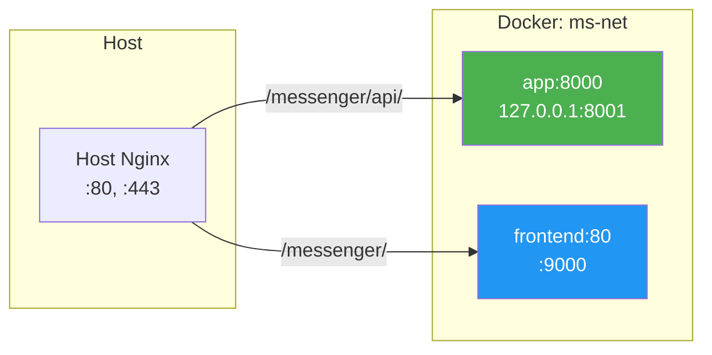
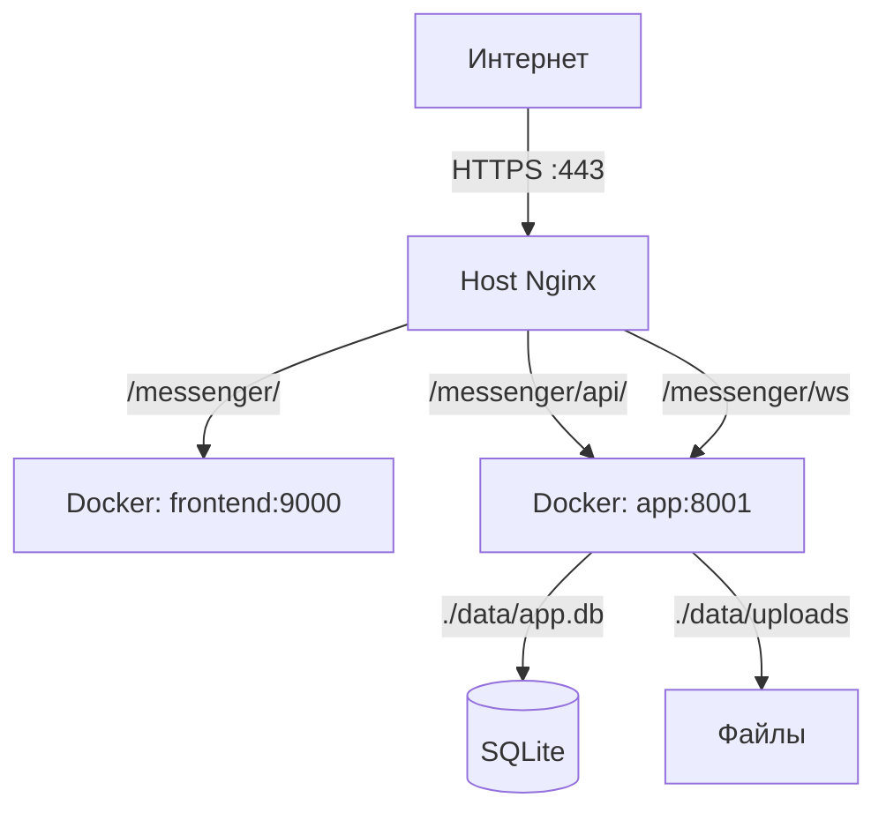

# Раздел 11: Docker и контейнеризация

## 11.1. Backend Dockerfile

[`Dockerfile`](Dockerfile) — multi-stage build для минимального production-образа.

### Stage 1: deps

```dockerfile
FROM python:3.12-slim AS deps

# Системные зависимости
RUN apt-get update && apt-get install -y --no-install-recommends \
    libmagic1 \
    && rm -rf /var/lib/apt/lists/*

# Установка Poetry
RUN pip install --no-cache-dir poetry==1.8.3

WORKDIR /app

# Копирование только файлов зависимостей (кеш при изменении кода)
COPY pyproject.toml poetry.lock ./

# Установка только production зависимостей
RUN poetry config virtualenvs.create false \
    && poetry install --no-interaction --no-ansi --no-root --without dev
```

**Оптимизации:**
- `--no-install-recommends` — минимальный набор пакетов
- `--no-root` — установка зависимостей без установки самого пакета
- `--without dev` — исключение dev-зависимостей
- Отдельный stage для кеширования слоёв зависимостей

### Stage 2: runtime

```dockerfile
FROM python:3.12-slim AS runtime

# Только runtime зависимости
RUN apt-get update && apt-get install -y --no-install-recommends \
    libmagic1 \
    && rm -rf /var/lib/apt/lists/* \
    && useradd -m -u 1000 app

WORKDIR /app

# Копирование зависимостей из deps
COPY --from=deps /usr/local/lib/python3.12/site-packages /usr/local/lib/python3.12/site-packages
COPY --from=deps /usr/local/bin /usr/local/bin

# Копирование только кода приложения
COPY --chown=app:app messenger/ ./messenger/

# Создание директорий
RUN mkdir -p /app/data/uploads /app/data/logs \
    && chown -R app:app /app/data

USER app

EXPOSE 8000

CMD ["uvicorn", "messenger.main:app", "--host", "0.0.0.0", "--port", "8000", "--workers", "1"]
```

**Безопасность:**
- Non-root user (`app`, uid 1000)
- Копирование только `messenger/` (без тестов, docs)
- `--chown=app:app` — правильные права на файлы

### Почему 1 worker?

SQLite не поддерживает конкурентную запись из нескольких процессов. Один worker гарантирует целостность данных.

## 11.2. Frontend Dockerfile

[`frontend/Dockerfile`](frontend/Dockerfile):

```dockerfile
# Stage 1: Build
FROM node:20-alpine AS build
WORKDIR /app
COPY package.json ./
RUN npm install
COPY . .
RUN npm run build

# Stage 2: Serve
FROM nginx:alpine
COPY --from=build /app/dist /usr/share/nginx/html
COPY nginx.conf /etc/nginx/conf.d/default.conf
EXPOSE 80
CMD ["nginx", "-g", "daemon off;"]
```

**Особенности:**
- Alpine-образы для минимального размера (~50MB vs ~900MB)
- Nginx для раздачи статики (не Node.js в production)
- `daemon off;` — Nginx в foreground (требование Docker)

## 11.3. Docker Compose

[`docker-compose.yml`](docker-compose.yml):

```yaml
services:
  app:
    build:
      context: .
      dockerfile: Dockerfile
    restart: unless-stopped
    env_file: .env
    ports:
      - "127.0.0.1:8001:8000"
    volumes:
      - ./data:/app/data
    networks:
      - ms-net
    healthcheck:
      test: ["CMD", "curl", "-f", "http://localhost:8000/health"]
      interval: 30s
      timeout: 10s
      retries: 3
      start_period: 10s
    deploy:
      resources:
        limits:
          cpus: "1.0"
          memory: 512M

  frontend:
    build:
      context: ./frontend
      dockerfile: Dockerfile
    restart: unless-stopped
    ports:
      - "9000:80"
    networks:
      - ms-net
    depends_on:
      - app

networks:
  ms-net:
    driver: bridge
```

### Сервисы

| Сервис | Порт | Назначение |
|--------|------|------------|
| `app` | 127.0.0.1:8001 → 8000 | Backend (FastAPI) |
| `frontend` | 9000 → 80 | Frontend (nginx + SPA) |

### Volume mapping

| Volume | Container path | Назначение |
|--------|---------------|------------|
| `./data` | `/app/data` | БД, файлы, логи |

### Network

```
ms-net (bridge)
├── app (internal: 8000)
└── frontend (internal: 80)
```

Frontend и backend общаются через Docker DNS по имени сервиса.

## 11.4. Resource Limits

```yaml
deploy:
  resources:
    limits:
      cpus: "1.0"
      memory: 512M
```

**Обоснование:**
- 1 CPU — SQLite один писатель, больше не нужно
- 512MB — FastAPI + SQLite + python-magic + Loguru

## 11.5. Health Checks

```yaml
healthcheck:
  test: ["CMD", "curl", "-f", "http://localhost:8000/health"]
  interval: 30s
  timeout: 10s
  retries: 3
  start_period: 10s
```

**Параметры:**
- `start_period: 10s` — время на инициализацию БД
- `retries: 3` — 3 попытки перед unhealthy
- `interval: 30s` — проверка каждые 30 секунд

## 11.6. Сетевая архитектура



**Port mapping:**
- `127.0.0.1:8001` — только localhost (не доступен извне)
- `9000` — frontend (для тестирования без nginx)

## 11.7. .dockerignore

**Backend:**
```
__pycache__/
*.pyc
.git/
tests/
.venv/
data/
backups/
```

**Frontend:**
```
node_modules/
dist/
.git/
```

---

# Раздел 12: Nginx и проксирование

## 12.1. Frontend Nginx

[`frontend/nginx.conf`](frontend/nginx.conf):

```nginx
server {
    listen 80;
    server_name _;
    root /usr/share/nginx/html;
    index index.html;

    # Gzip сжатие
    gzip on;
    gzip_types text/plain text/css application/json application/javascript text/xml application/xml;
    gzip_min_length 1000;

    # Статические файлы (кэширование на 1 год)
    location /assets/ {
        expires 1y;
        add_header Cache-Control "public, immutable";
    }

    # SPA fallback
    location / {
        try_files $uri $uri/ /index.html;
    }

    # Security headers
    add_header X-Frame-Options "SAMEORIGIN" always;
    add_header X-Content-Type-Options "nosniff" always;
    add_header X-XSS-Protection "1; mode=block" always;
    add_header Referrer-Policy "strict-origin-when-cross-origin" always;
}
```

**Ключевые особенности:**
- `try_files $uri $uri/ /index.html` — SPA routing (все запросы → index.html)
- Gzip для всех текстовых типов
- Cache-Control для assets (hash в имени файла → immutable)

## 12.2. Production Nginx

Скрипт [`deploy.sh`](scripts/deploy.sh) настраивает location блоки в хостовом nginx:

### Upstream

```nginx
upstream messenger_backend {
    server 127.0.0.1:8001;
    keepalive 32;
}

upstream messenger_frontend {
    server 127.0.0.1:9000;
    keepalive 32;
}
```

### Location blocks

```nginx
location /messenger/ {
    proxy_pass http://messenger_frontend/messenger/;
    proxy_http_version 1.1;
    proxy_set_header Host $host;
    proxy_set_header X-Real-IP $remote_addr;
    proxy_set_header X-Forwarded-For $proxy_add_x_forwarded_for;
    proxy_set_header X-Forwarded-Proto $scheme;
}

location /messenger/api/ {
    proxy_pass http://messenger_backend/api/;
    proxy_http_version 1.1;
    proxy_set_header Host $host;
    proxy_set_header X-Real-IP $remote_addr;
    proxy_set_header X-Forwarded-For $proxy_add_x_forwarded_for;
    proxy_set_header X-Forwarded-Proto $scheme;
}

location /messenger/ws {
    proxy_pass http://messenger_backend/ws;
    proxy_http_version 1.1;
    proxy_set_header Upgrade $http_upgrade;
    proxy_set_header Connection "upgrade";
    proxy_set_header Host $host;
    proxy_set_header X-Real-IP $remote_addr;
    proxy_set_header X-Forwarded-For $proxy_add_x_forwarded_for;
    proxy_set_header X-Forwarded-Proto $scheme;
    proxy_connect_timeout 7d;
    proxy_send_timeout 7d;
    proxy_read_timeout 7d;
}

location /messenger/health {
    proxy_pass http://messenger_backend/health;
}
```

## 12.3. WebSocket проксирование

Критически важные директивы для WebSocket:

```nginx
proxy_set_header Upgrade $http_upgrade;
proxy_set_header Connection "upgrade";
proxy_read_timeout 7d;
proxy_send_timeout 7d;
proxy_connect_timeout 7d;
```

**Без этих директив:**
- WebSocket upgrade не пройдёт
- Соединение будет закрыто через 60 секунд (default timeout)

## 12.4. Upstream конфигурация

```nginx
upstream messenger_backend {
    server 127.0.0.1:8001;
    keepalive 32;
}
```

**keepalive 32:**
- 32 idle-соединения к бэкенду
- Уменьшает latency (не нужно устанавливать TCP каждый раз)
- Не влияет на WebSocket (отдельное соединение)

## 12.5. SSL/TLS

### Certbot

```bash
sudo certbot --nginx -d your-domain.com --email your@email.com
```

**Что делает certbot:**
1. Получает сертификат от Let's Encrypt
2. Автоматически настраивает nginx для HTTPS
3. Добавляет cron job для автообновления

### Автообновление

```bash
# Certbot добавляет автоматически:
0 */12 * * * certbot renew --quiet
```

Проверка каждые 12 часов, обновление при < 30 дней до истечения.

---

# Раздел 13: Процесс деплоя

## 13.1. Обзор

Архитектура деплоя: **Docker Compose + хостовой nginx**.



**Не используется:**
- Kubernetes (избыточно)
- Caddy (используется хостовой nginx)
- CI/CD pipeline (ручной деплой)

## 13.2. Скрипт deploy.sh

[`scripts/deploy.sh`](scripts/deploy.sh) — пошаговый скрипт развёртывания.

### Использование

```bash
sudo MESSENGER_DOMAIN=gshjis.org \
     MESSENGER_EMAIL=ilya.togan@gmail.com \
     bash scripts/deploy.sh
```

### Этапы

#### Этап 1: Проверки

```bash
# Проверка root
if [ "$(id -u)" -ne 0 ]; then
    die "Требуется root или sudo"
fi

# Проверка Docker
if ! command -v docker &>/dev/null; then
    die "Docker не найден"
fi

# Проверка Docker Compose
if ! docker compose version &>/dev/null; then
    die "Docker Compose не найден"
fi

# Проверка домена
if [ "$DOMAIN" = "YOUR_DOMAIN_HERE" ]; then
    die "Укажите MESSENGER_DOMAIN"
fi
```

#### Этап 2: Настройка .env

```bash
if [ ! -f "$env_file" ]; then
    jwt_secret=$(python3 -c "import secrets; print(secrets.token_urlsafe(32))")
    
    cat > "$env_file" <<EOF
JWT_SECRET_KEY=${jwt_secret}
CORS_ORIGINS=https://${DOMAIN}
...
EOF
    chmod 600 "$env_file"
fi
```

#### Этап 3: Сборка и запуск контейнеров

```bash
cd "$INSTALL_DIR"
mkdir -p ./data/uploads ./data/logs
chmod -R 777 ./data

docker compose build --no-cache
docker compose up -d

# Проверка
if docker compose ps app | grep -q "Up"; then
    log_ok "Backend запущен"
fi
```

#### Этап 4: Настройка nginx location

```bash
# Upstream файл
cat > "/etc/nginx/snippets/messenger-upstream.conf" <<EOF
upstream messenger_backend {
    server 127.0.0.1:8001;
    keepalive 32;
}
EOF

# Location фрагмент
cat > "/etc/nginx/snippets/messenger-locations.conf" <<EOF
location /messenger/ { ... }
location /messenger/api/ { ... }
location /messenger/ws { ... }
EOF

# Добавление include в существующий конфиг
sed -i '/http {/a\    include /etc/nginx/snippets/messenger-upstream.conf;' /etc/nginx/nginx.conf
sed -i '/^}$/i\    include /etc/nginx/snippets/messenger-locations.conf;' "$main_conf"
```

#### Этап 5: Логирование

```bash
mkdir -p "$LOG_DIR"  # /var/log/messenger
```

#### Этап 6: SSL сертификат

```bash
if [ -f "/etc/letsencrypt/live/${DOMAIN}/fullchain.pem" ]; then
    log_ok "SSL сертификат уже существует"
else
    certbot --nginx -d "$DOMAIN" --email "$EMAIL" --agree-tos --no-eff-email
fi
```

#### Этап 7: Инициализация

```bash
# Проверка наличия invite-кодов
count=$(python3 -c "
import sqlite3
conn = sqlite3.connect('${db_file}')
c = conn.cursor()
c.execute('SELECT COUNT(*) FROM invite_codes')
print(c.fetchone()[0])
")

if [ "$count" -eq 0 ]; then
    code=$(python3 -c "import secrets, string; print(''.join(secrets.choice(string.ascii_uppercase + string.digits) for _ in range(8)))")
    sqlite3 "$db_file" "INSERT INTO invite_codes (code, max_uses, used_count, is_active, created_at) VALUES ('${code}', 1, 0, 1, datetime('now'))"
    log_ok "Первый invite код создан: ${code}"
fi
```

## 13.3. Откат

```bash
sudo bash scripts/deploy.sh --rollback
```

**Что делает rollback:**
1. `docker compose down` — остановка контейнеров
2. Удаление nginx конфигов
3. Удаление логов
4. Перезагрузка nginx

## 13.4. Makefile команды

| Команда | Описание |
|---------|----------|
| `make up` | Запуск всех сервисов |
| `make build` | Сборка с нуля без кеша |
| `make down` | Остановка всех сервисов |
| `make restart` | Перезапуск (down + up) |
| `make logs` | Логи приложения |
| `make logs-all` | Логи всех сервисов |
| `make backup` | Создание бэкапа БД |
| `make restore BACKUP_FILE=path` | Восстановление из бэкапа |
| `make test` | Запуск тестов |
| `make test-cov` | Тесты с coverage |
| `make lint` | Линтинг (ruff) |
| `make format` | Форматирование кода |
| `make typecheck` | Проверка типов (mypy) |
| `make install` | Установка зависимостей |
| `make hooks` | Установка pre-commit hooks |
| `make clean` | Очистка кеша |
| `make clean-all` | Полная очистка (включая data) |

## 13.5. Обновление приложения

```bash
cd /opt/messenger
git pull
make restart
```

**Post-merge hook:**
```bash
cp hooks/post-merge .git/hooks/post-merge
chmod +x .git/hooks/post-merge
```

При `git merge` в main автоматически запускаются тесты. Если тесты провалились — merge отменяется.

## 13.6. VPS deployment guide

### Пошаговая инструкция

```bash
# 1. Подготовка сервера
sudo apt update && sudo apt upgrade -y
sudo apt install -y docker.io docker-compose-plugin nginx git python3

# 2. Клонирование
git clone <repo-url> /opt/messenger
cd /opt/messenger

# 3. Настройка DNS
# В панели регистратора: A-запись → IP сервера

# 4. Настройка .env
cp .env.example .env
# Отредактируйте JWT_SECRET_KEY, MESSENGER_DOMAIN, MESSENGER_EMAIL

# 5. Деплой
sudo MESSENGER_DOMAIN=your-domain.com \
     MESSENGER_EMAIL=your@email.com \
     bash scripts/deploy.sh

# 6. Проверка
curl https://your-domain.com/messenger/health
# {"status":"ok","version":"0.1.0"}

# 7. Создание первого пользователя
bash scripts/init.sh
# Запомните invite-код
```
