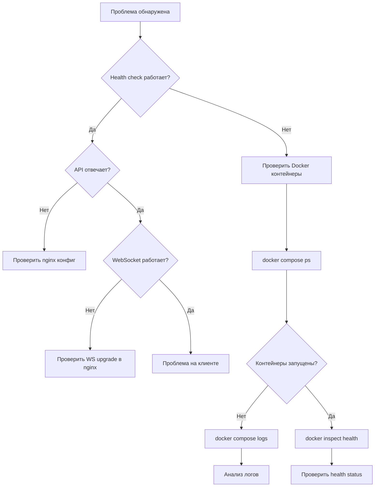

# Раздел 17: Мониторинг и логирование

## 17.1. Логирование приложения

### Loguru конфигурация

```python
logger.remove(0)  # Удаление default handler
logger.add(
    sys.stderr,
    level=settings.log_level,
    format="<green>{time:YYYY-MM-DD HH:mm:ss}</green> | <level>{level: <8}</level> | <cyan>{name}</cyan>:<cyan>{function}</cyan> - <level>{message}</level>",
)
```

**Формат:**
```
2024-01-15 10:30:00 | INFO     | messenger.api.auth:login - User admin logged in
2024-01-15 10:30:01 | ERROR    | messenger.websockets.handler:websocket_endpoint - WebSocket error for user 5
```

### Уровни логирования

| Уровень | Когда использовать | Пример |
|---------|-------------------|--------|
| DEBUG | Отладочная информация | — |
| INFO | Нормальные операции | "User logged in", "New user registered" |
| WARNING | Потенциальные проблемы | — |
| ERROR | Ошибки | "WebSocket error", "File upload failed" |

### Логирование в файл

```python
logger.add(
    log_dir / "messenger_{time:YYYY-MM-DD}.log",
    rotation="1 day",
    retention="30 days",
    level="INFO",
    enqueue=True,
)
```

**Параметры:**
- `rotation="1 day"` — новый файл каждый день
- `retention="30 days"` — удаление файлов старше 30 дней
- `level="INFO"` — только INFO и выше
- `enqueue=True` — thread-safe очередь (не блокирует основной поток)

## 17.2. Логи в файл

**Расположение:** `./data/logs/messenger_YYYY-MM-DD.log`

**Пример содержимого:**
```
2024-01-15 10:00:00 | INFO     | messenger.main:lifespan - Starting messenger...
2024-01-15 10:00:00 | INFO     | messenger.main:lifespan - Log level: INFO
2024-01-15 10:00:00 | INFO     | messenger.main:lifespan - Debug mode: False
2024-01-15 10:00:01 | INFO     | messenger.main:lifespan - Database initialized
2024-01-15 10:05:00 | INFO     | messenger.api.auth:login - User admin logged in
2024-01-15 10:05:01 | INFO     | messenger.api.auth:register - New user registered: alice
2024-01-15 10:05:02 | INFO     | messenger.api.chat:send_message - Message sent in chat 1
2024-01-15 10:06:00 | INFO     | messenger.api.files:upload_file - File uploaded: photo.jpg (image/jpeg, 102400 bytes) by user 1
```

## 17.3. Docker логи

```bash
# Логи backend
docker compose logs -f app --tail=100

# Логи frontend
docker compose logs -f frontend --tail=100

# Все логи
docker compose logs -f --tail=100
```

**Makefile:**
```bash
make logs       # Backend логи
make logs-all   # Все логи
```

## 17.4. Health Check мониторинг

### Docker healthcheck

```yaml
healthcheck:
  test: ["CMD", "curl", "-f", "http://localhost:8000/health"]
  interval: 30s
  timeout: 10s
  retries: 3
  start_period: 10s
```

### Проверка статуса

```bash
docker inspect --format='{{.State.Health.Status}}' messenger-app-1
# healthy / unhealthy / starting
```

### Endpoint /health

```bash
curl http://127.0.0.1:8001/health
# {"status": "ok", "version": "0.1.0"}
```

## 17.5. Рекомендуемый мониторинг

### Uptime Kuma

```bash
docker run -d \
  --name uptime-kuma \
  -p 3001:3001 \
  -v uptime-kuma:/app/data \
  louislam/uptime-kuma
```

**Настройка:**
- URL: `https://your-domain.com/messenger/health`
- Interval: 60s
- Timeout: 10s
- Notification: Email, Telegram, Slack

### Prometheus + Grafana (опционально)

**docker-compose.yml addition:**
```yaml
  prometheus:
    image: prom/prometheus
    volumes:
      - ./prometheus.yml:/etc/prometheus/prometheus.yml
    ports:
      - "9090:9090"

  grafana:
    image: grafana/grafana
    ports:
      - "3000:3000"
    depends_on:
      - prometheus
```

**prometheus.yml:**
```yaml
scrape_configs:
  - job_name: 'messenger'
    static_configs:
      - targets: ['app:8000']
    metrics_path: '/metrics'  # Требует prometheus-fastapi-instrumentator
```

## 17.6. Алертинг

### Email уведомления

Через Uptime Kuma или cron-скрипт:

```bash
#!/usr/bin/env bash
# Проверка доступности
http_code=$(curl -s -o /dev/null -w "%{http_code}" https://your-domain.com/messenger/health)

if [ "$http_code" != "200" ]; then
    echo "Messenger is down! HTTP $http_code" | mail -s "Messenger Alert" admin@domain.com
fi
```

### Webhook интеграции

```bash
# Telegram bot
curl -s "https://api.telegram.org/bot<TOKEN>/sendMessage" \
  -d "chat_id=<CHAT_ID>&text=Messenger health check failed: HTTP $http_code"
```

---

# Раздел 18: Руководство по устранению проблем

## 18.1. Диагностика

### Пошаговый подход



## 18.2. Частые проблемы

### Backend не запускается

**Симптомы:**
- `docker compose ps` показывает `Exit 1`
- Health check fails

**Диагностика:**
```bash
docker compose logs app --tail=50
```

**Частые причины:**

| Причина | Решение |
|---------|---------|
| `JWT_SECRET_KEY must be changed` | Сгенерируйте новый ключ |
| Port already in use | `sudo lsof -i :8001` → kill процесс |
| Permission denied на data/ | `chmod -R 777 ./data` |
| SQLite locked | Удалите `data/app.db-wal` и `data/app.db-shm` |
| Missing libmagic | `apt-get install libmagic1` |

### WebSocket не подключается

**Симптомы:**
- Сообщения не приходят в реальном времени
- Console: `WebSocket connection failed`

**Диагностика:**
```bash
# Проверка nginx конфига
nginx -t

# Проверка WS upgrade
curl -i -N \
  -H "Connection: Upgrade" \
  -H "Upgrade: websocket" \
  -H "Sec-WebSocket-Key: dGhlIHNhbXBsZSBub25jZQ==" \
  -H "Sec-WebSocket-Version: 13" \
  https://your-domain.com/messenger/ws?token=<token>
```

**Решение:**
- Проверьте `proxy_set_header Upgrade $http_upgrade` в nginx
- Проверьте `proxy_read_timeout 7d`
- Убедитесь что токен валиден

### Файлы не загружаются

**Симптомы:**
- 400 Bad Request при upload
- 413 Payload Too Large

**Диагностика:**
```bash
# Проверка размера файла
ls -la file.jpg

# Проверка MIME типа
file --mime-type file.jpg
```

**Решение:**
- Увеличьте `MAX_FILE_SIZE_MB` в .env
- Проверьте `client_max_body_size` в nginx (default: 1m)
- Добавьте в nginx: `client_max_body_size 25m;`

### JWT token не работает

**Симптомы:**
- 401 Unauthorized на всех запросах
- Редирект на /auth

**Диагностика:**
```bash
# Проверка токена
python3 -c "
from messenger.security.auth import decode_access_token
print(decode_access_token('<token>'))
"
```

**Решение:**
- Проверьте `JWT_SECRET_KEY` — совпадает ли с тем, которым был подписан токен
- Проверьте `JWT_EXPIRE_MINUTES` — не истёк ли токен
- Очистите localStorage и войдите заново

### База данных повреждена

**Симптомы:**
- `database is locked`
- `malformed database schema`

**Диагностика:**
```bash
sqlite3 ./data/app.db "PRAGMA integrity_check;"
```

**Решение:**
```bash
# Восстановление из бэкапа
make restore BACKUP_FILE=./backups/app_YYYY-MM-DD.db.gz

# Если бэкапа нет — пересоздание
docker compose down
rm ./data/app.db
docker compose up -d
```

### Nginx 502 Bad Gateway

**Симптомы:**
- Браузер показывает 502

**Диагностика:**
```bash
# Проверка backend
curl http://127.0.0.1:8001/health

# Проверка nginx error log
tail -50 /var/log/nginx/error.log
```

**Решение:**
- Убедитесь что backend запущен: `docker compose ps app`
- Проверьте upstream в nginx: `server 127.0.0.1:8001`
- Перезапустите nginx: `sudo systemctl reload nginx`

### CORS ошибки

**Симптомы:**
- Console: `Access to fetch blocked by CORS policy`

**Диагностика:**
```bash
curl -I -X OPTIONS https://your-domain.com/messenger/api/auth/login \
  -H "Origin: https://your-domain.com" \
  -H "Access-Control-Request-Method: POST"
```

**Решение:**
- Добавьте origin в `CORS_ORIGINS` в .env
- Перезапустите backend: `docker compose restart app`

## 18.3. Логи

### Где искать

| Источник | Путь | Команда |
|----------|------|---------|
| Backend (файл) | `./data/logs/messenger_*.log` | `tail -f ./data/logs/messenger_*.log` |
| Backend (Docker) | — | `docker compose logs -f app` |
| Frontend (Docker) | — | `docker compose logs -f frontend` |
| Nginx access | `/var/log/nginx/access.log` | `tail -f /var/log/nginx/access.log` |
| Nginx error | `/var/log/nginx/error.log` | `tail -f /var/log/nginx/error.log` |

### Как читать

**Backend лог:**
```
2024-01-15 10:30:00 | INFO     | messenger.api.auth:login - User admin logged in
```
- Timestamp | Level | Module:Function | Message

**Nginx error:**
```
2024/01/15 10:30:00 [error] 1234#0: *5678 connect() failed (111: Connection refused)
```
- Timestamp | Level | PID | Connection | Error message

## 18.4. Docker

### Основные команды

```bash
# Статус контейнеров
docker compose ps

# Логи
docker compose logs -f app --tail=100

# Перезапуск
docker compose restart app

# Полная перезагрузка
docker compose down && docker compose up -d

# Очистка
docker compose down -v  # Удаляет volumes (ВНИМАНИЕ: данные БД!)
```

### Resource usage

```bash
# CPU и память
docker stats

# Дисковое пространство
docker system df
docker system prune -a  # Осторожно!
```

## 18.5. База данных

### SQLite CLI

```bash
# Подключение
sqlite3 ./data/app.db

# Список таблиц
.tables

# Схема таблицы
.schema users

# Запрос
SELECT username, is_active FROM users;

# Integrity check
PRAGMA integrity_check;

# Размер таблиц
SELECT name, sum(pgsize) as size FROM dbstat GROUP BY name ORDER BY size DESC;
```

### Восстановление

```bash
# Из бэкапа
sqlite3 ./data/app.db ".restore ./backups/app_2024-01-01.db"

# Dump и recreate
sqlite3 ./data/app.db ".dump" | sqlite3 ./data/app_new.db
mv ./data/app_new.db ./data/app.db
```

## 18.6. Сеть

### curl тесты

```bash
# Health check
curl -v http://127.0.0.1:8001/health

# API test
curl -v -X POST http://127.0.0.1:8001/api/auth/login \
  -H "Content-Type: application/json" \
  -d '{"username":"admin","password":"password"}'

# WebSocket test
wscat -c "ws://127.0.0.1:8001/ws?token=<token>"
```

### Port checking

```bash
# Кто слушает порт
sudo lsof -i :8001
sudo ss -tlnp | grep 8001

# Firewall
sudo iptables -L -n
sudo ufw status
```

## 18.7. FAQ

**Q: Как сбросить пароль?**
A: Пароли хешированы. Создайте нового пользователя с новым invite-кодом.

**Q: Как удалить пользователя?**
A: Через SQLite: `UPDATE users SET is_banned = 1 WHERE username = '...';`

**Q: Как увеличить лимит участников в чате?**
A: Это ограничение MVP. Для увеличения нужно изменить бизнес-логику.

**Q: Можно ли мигрировать на PostgreSQL?**
A: Да. SQLModel поддерживает PostgreSQL. Нужно изменить `DATABASE_URL` и создать миграции.

**Q: Как обновить мессенджер?**
A: `git pull && make restart`

---

# Раздел 19: Приложение

## A. Полная схема БД

```sql
CREATE TABLE users (
    id INTEGER PRIMARY KEY AUTOINCREMENT,
    username VARCHAR NOT NULL UNIQUE,
    hashed_password VARCHAR NOT NULL,
    avatar_path VARCHAR(500),
    is_active BOOLEAN NOT NULL DEFAULT 1,
    is_banned BOOLEAN NOT NULL DEFAULT 0,
    created_at DATETIME NOT NULL DEFAULT (datetime('now')),
    updated_at DATETIME NOT NULL DEFAULT (datetime('now'))
);

CREATE INDEX ix_users_username ON users (username);

CREATE TABLE chats (
    id INTEGER PRIMARY KEY AUTOINCREMENT,
    type VARCHAR NOT NULL DEFAULT 'personal',
    name VARCHAR(200),
    description VARCHAR(1000),
    avatar_path VARCHAR(500),
    created_at DATETIME NOT NULL DEFAULT (datetime('now')),
    updated_at DATETIME NOT NULL DEFAULT (datetime('now'))
);

CREATE TABLE chat_members (
    id INTEGER PRIMARY KEY AUTOINCREMENT,
    chat_id INTEGER NOT NULL,
    user_id INTEGER NOT NULL,
    role VARCHAR NOT NULL DEFAULT 'member',
    joined_at DATETIME NOT NULL DEFAULT (datetime('now')),
    FOREIGN KEY (chat_id) REFERENCES chats (id),
    FOREIGN KEY (user_id) REFERENCES users (id)
);

CREATE INDEX ix_chat_members_chat_id ON chat_members (chat_id);
CREATE INDEX ix_chat_members_user_id ON chat_members (user_id);

CREATE TABLE messages (
    id INTEGER PRIMARY KEY AUTOINCREMENT,
    chat_id INTEGER NOT NULL,
    sender_id INTEGER NOT NULL,
    content VARCHAR(10000),
    file_path VARCHAR(500),
    file_mime VARCHAR(100),
    file_size INTEGER,
    status VARCHAR NOT NULL DEFAULT 'sent',
    is_deleted BOOLEAN NOT NULL DEFAULT 0,
    created_at DATETIME NOT NULL DEFAULT (datetime('now')),
    updated_at DATETIME NOT NULL DEFAULT (datetime('now')),
    FOREIGN KEY (chat_id) REFERENCES chats (id),
    FOREIGN KEY (sender_id) REFERENCES users (id)
);

CREATE INDEX ix_messages_chat_id ON messages (chat_id);
CREATE INDEX ix_messages_sender_id ON messages (sender_id);

CREATE TABLE invite_codes (
    id INTEGER PRIMARY KEY AUTOINCREMENT,
    code VARCHAR(50) NOT NULL UNIQUE,
    max_uses INTEGER NOT NULL DEFAULT 1,
    used_count INTEGER NOT NULL DEFAULT 0,
    created_by INTEGER,
    created_at DATETIME NOT NULL DEFAULT (datetime('now')),
    expires_at DATETIME,
    is_active BOOLEAN NOT NULL DEFAULT 1,
    FOREIGN KEY (created_by) REFERENCES users (id)
);

CREATE INDEX ix_invite_codes_code ON invite_codes (code);
```

## B. Полные API спецификации

OpenAPI/Swagger документация доступна по адресу:
```
http://localhost:8001/docs
http://localhost:8001/redoc
```

## C. WebSocket протокол

### Подключение

```
GET /ws?token=<jwt_token>
```

### Клиент → Сервер

| Action | Payload | Описание |
|--------|---------|----------|
| `subscribe` | `{chat_id: number}` | Подписка на чат |
| `unsubscribe` | `{chat_id: number}` | Отписка от чата |
| `message` | `{chat_id: number, content: string}` | Отправка сообщения |
| `mark_read` | `{chat_id: number, message_id?: number}` | Отметка прочитанного |
| `ping` | — | Keepalive |

### Сервер → Клиент

| Type | Payload | Описание |
|------|---------|----------|
| `subscribed` | `{chat_id: number}` | Подписка подтверждена |
| `new_message` | `{chat_id: number, message: MessageResponse}` | Новое сообщение |
| `message_read` | `{chat_id: number, message_id: number, read_by: number}` | Сообщение прочитано |
| `pong` | — | Ответ на ping |
| `error` | `{message: string}` | Ошибка |

## D. Переменные окружения

Полная таблица — см. [Раздел 3.4](#34-конфигурация-env).

## E. Чек-лист production readiness

### Перед деплоем

- [ ] `JWT_SECRET_KEY` сгенерирован
- [ ] `DEBUG=false`
- [ ] `CORS_ORIGINS` ограничен production доменом
- [ ] HTTPS настроен (Let's Encrypt)
- [ ] Бэкапы настроены (cron)
- [ ] Мониторинг настроен (Uptime Kuma)
- [ ] Firewall настроен (только 80, 443)
- [ ] Docker resource limits установлены
- [ ] Первый invite-код создан

### После деплоя

- [ ] Health check возвращает 200
- [ ] Регистрация работает
- [ ] Логин работает
- [ ] WebSocket подключается
- [ ] Файлы загружаются (если реализовано)
- [ ] Бэкап создан вручную для проверки
- [ ] Логи пишутся в файл

## F. Ссылки на документацию зависимостей

| Зависимость | Документация |
|-------------|-------------|
| FastAPI | https://fastapi.tiangolo.com/ |
| SQLModel | https://sqlmodel.tiangolo.com/ |
| Pydantic | https://docs.pydantic.dev/ |
| Argon2-CFFI | https://argon2-cffi.readthedocs.io/ |
| python-jose | https://python-jose.readthedocs.io/ |
| Loguru | https://github.com/Delgan/loguru |
| Vue 3 | https://vuejs.org/ |
| Pinia | https://pinia.vuejs.org/ |
| Vite | https://vitejs.dev/ |
| Docker | https://docs.docker.com/ |
| Nginx | https://nginx.org/en/docs/ |

## G. Лицензия (MIT)

```
MIT License

Copyright (c) 2024 gshjis

Permission is hereby granted, free of charge, to any person obtaining a copy
of this software and associated documentation files (the "Software"), to deal
in the Software without restriction, including without limitation the rights
to use, copy, modify, merge, publish, distribute, sublicense, and/or sell
copies of the Software, and to permit persons to whom the Software is
furnished to do so, subject to the following conditions:

The above copyright notice and this permission notice shall be included in all
copies or substantial portions of the Software.

THE SOFTWARE IS PROVIDED "AS IS", WITHOUT WARRANTY OF ANY KIND, EXPRESS OR
IMPLIED, INCLUDING BUT NOT LIMITED TO THE WARRANTIES OF MERCHANTABILITY,
FITNESS FOR A PARTICULAR PURPOSE AND NONINFRINGEMENT. IN NO EVENT SHALL THE
AUTHORS OR COPYRIGHT HOLDERS BE LIABLE FOR ANY CLAIM, DAMAGES OR OTHER
LIABILITY, WHETHER IN AN ACTION OF CONTRACT, TORT OR OTHERWISE, ARISING FROM,
OUT OF OR IN CONNECTION WITH THE SOFTWARE OR THE USE OR OTHER DEALINGS IN THE
SOFTWARE.
```
