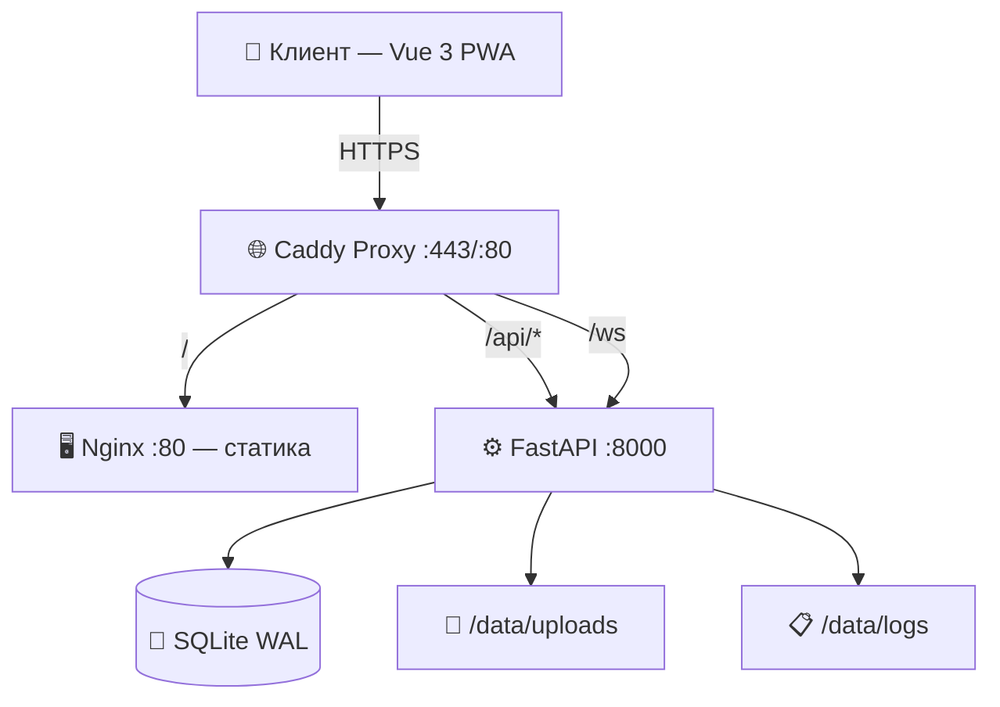
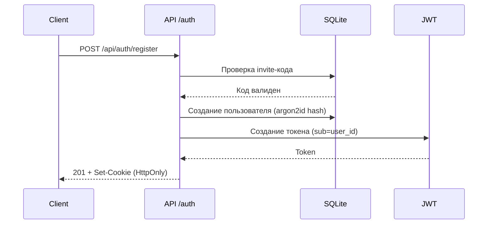
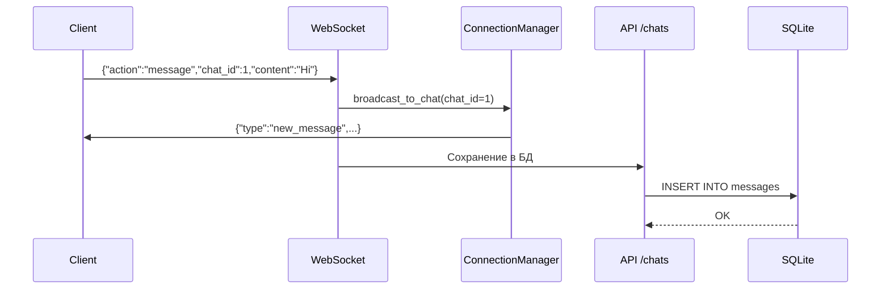
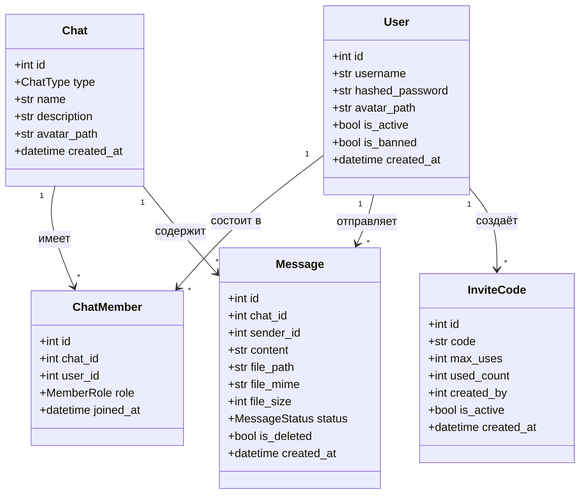

# 🏗️ Архитектура системы

## Общая схема



## Компоненты

### Backend (Python + FastAPI)

| Модуль | Файл | Описание |
|--------|------|----------|
| `main.py` | Точка входа, lifespan, middleware, роутеры |
| `config.py` | Настройки из .env через pydantic-settings |
| `database.py` | SQLite engine, WAL режим, сессии |
| `models/` | SQLModel модели данных |
| `schemas/` | Pydantic схемы для API |
| `api/` | REST endpoints |
| `websockets/` | WebSocket менеджер и обработчик |
| `security/` | JWT, argon2id, rate limiting |

### Frontend (Vue 3 + Vite PWA)

| Модуль | Файл | Описание |
|--------|------|----------|
| `main.js` | Инициализация Vue, Pinia, Router |
| `App.vue` | Корневой компонент |
| `router.js` | Маршруты /auth, / |
| `stores/auth.js` | Auth store (login, register, profile) |
| `stores/chat.js` | Chat store (chats, messages, WS) |
| `views/AuthView.vue` | Страница логина/регистрации |
| `views/ChatView.vue` | Sidebar + Chat + WebSocket |

## Потоки данных

### Аутентификация



### Отправка сообщения



## Зависимости

### Backend

```
fastapi ──┬── starlette (ASGI)
          ├── pydantic (валидация)
          └── uvicorn (сервер)

sqlmodel ─┬── sqlalchemy 2.0 (ORM)
          └── pydantic (схемы)

argon2-cffi ── хеширование паролей
python-jose ── JWT encode/decode
python-magic ── MIME проверка файлов
slowapi ── rate limiting
loguru ── логирование
```

### Frontend

```
vue 3 ── реактивный фреймворк
pinia ── state management
vue-router ── маршрутизация
vite ── сборщик
vite-plugin-pwa ── PWA manifest + service worker
```

## Диаграмма классов


