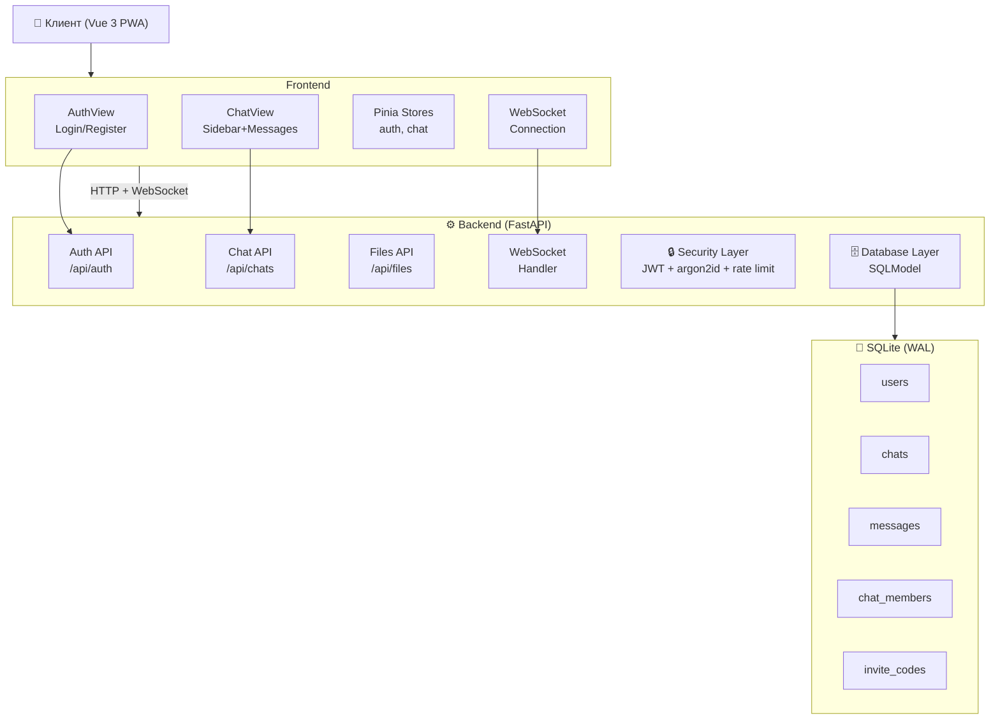
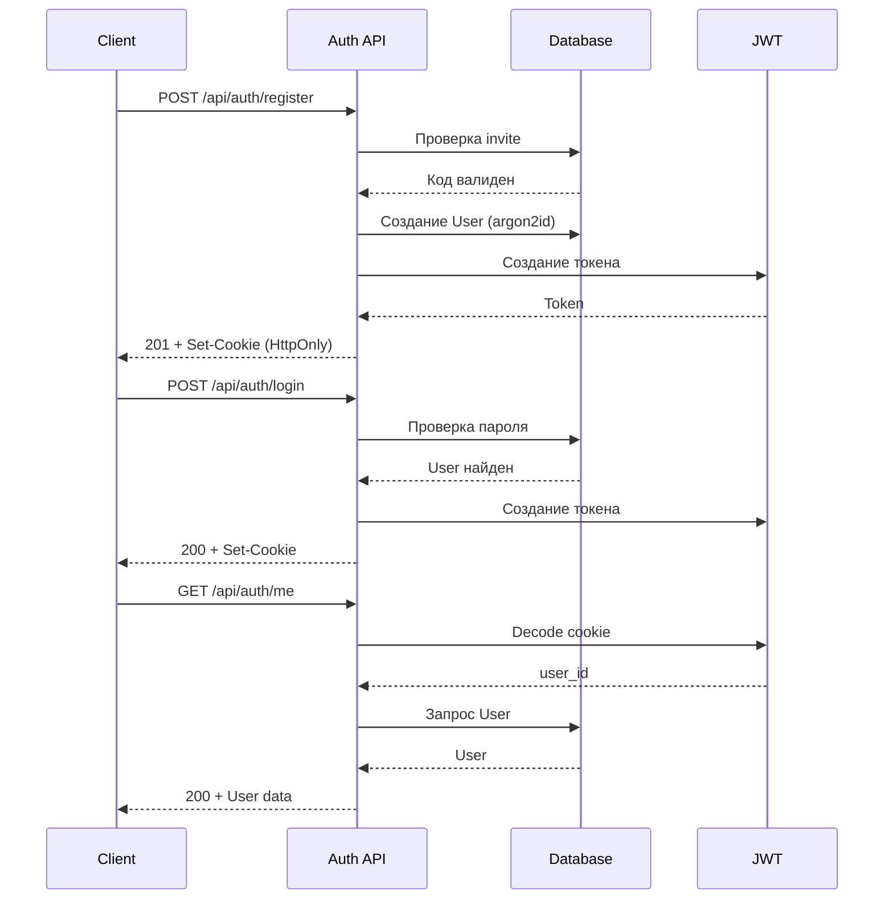
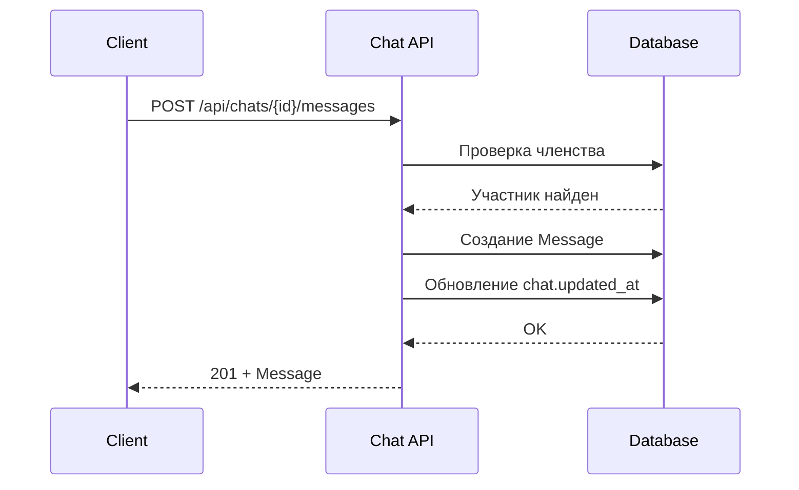
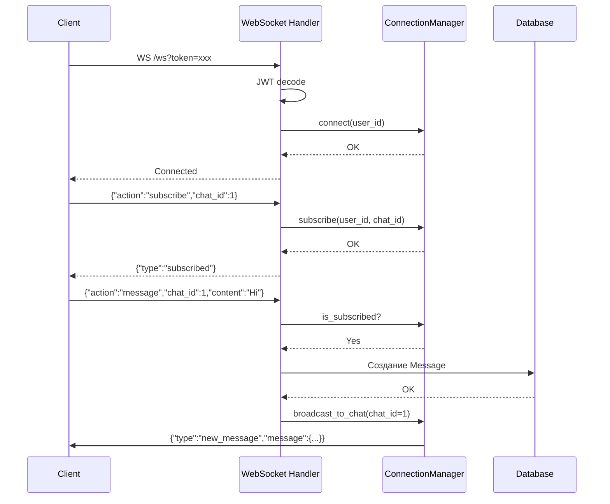
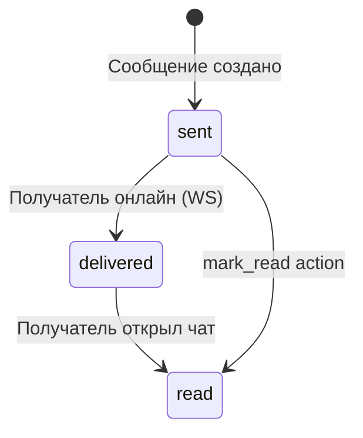

# 🏗️ Архитектура

## Общая схема



## Компоненты

### Backend (Python + FastAPI)

| Модуль | Файл | Описание |
|--------|------|----------|
| `main.py` | Точка входа | Lifespan, middleware (CORS, security headers, rate limiting), роутеры |
| `config.py` | Настройки | Pydantic Settings, загрузка из .env, валидация JWT_SECRET_KEY |
| `database.py` | БД | SQLite engine (singleton), WAL режим, async сессии с rollback |
| `models/` | Модели | SQLModel: User, Chat, ChatMember, Message, InviteCode |
| `schemas/` | Схемы | Pydantic: запросы/ответы API |
| `api/` | REST | Auth, Chat, Files endpoints |
| `websockets/` | WS | ConnectionManager, handler (subscribe, message, mark_read, ping) |
| `security/` | Auth | argon2id хеширование, JWT encode/decode, invite генерация |

### Frontend (Vue 3 + Vite PWA)

| Модуль | Файл | Описание |
|--------|------|----------|
| `main.js` | Инициализация | Vue app, Pinia, Router |
| `App.vue` | Корень | Автозагрузка пользователя при старте |
| `router.js` | Маршруты | `/auth` (guest), `/` (auth required) |
| `stores/auth.js` | Auth store | login, register, fetchMe, updateProfile, generateInvite, logout |
| `stores/chat.js` | Chat store | fetchChats, createChat, selectChat, fetchMessages, sendMessage |
| `views/AuthView.vue` | Логин/Регистрация | Формы с переключением |
| `views/ChatView.vue` | Чат | Sidebar, сообщения, WebSocket, профиль, темы |

## Потоки данных

### Аутентификация



### Отправка сообщения (REST)



### Отправка сообщения (WebSocket)



### Статусы сообщений



## Зависимости

### Backend
```
fastapi → starlette (ASGI) → uvicorn (сервер)
sqlmodel → sqlalchemy 2.0 (ORM) + pydantic (валидация)
argon2-cffi → хеширование паролей
python-jose → JWT encode/decode
python-magic → MIME проверка файлов
slowapi → rate limiting
loguru → логирование
aiosqlite → async SQLite драйвер
```

### Frontend
```
vue 3 → реактивный фреймворк (Composition API)
pinia → state management
vue-router → маршрутизация с guards
vite → сборщик
vite-plugin-pwa → PWA manifest + service worker
```
