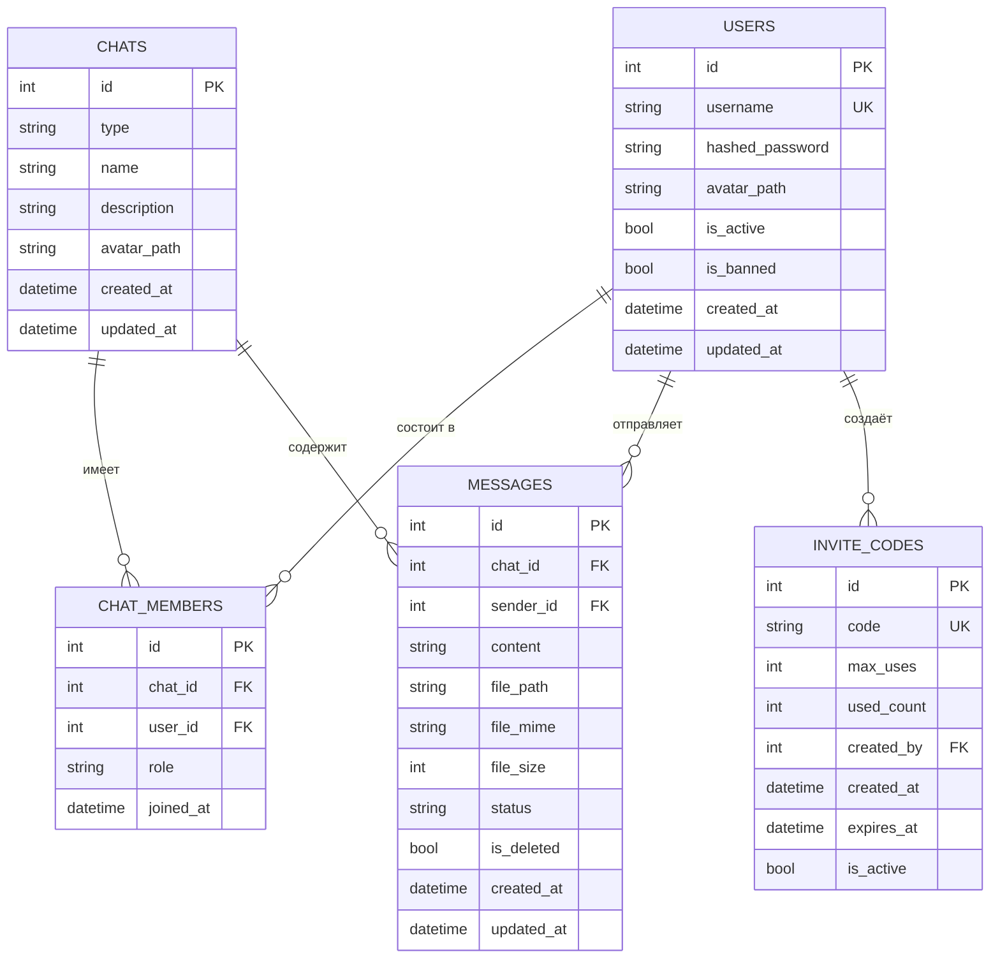

# 🗄️ Схема базы данных

## Обзор

- **СУБД:** SQLite 3
- **Режим журнала:** WAL (Write-Ahead Logging)
- **Синхронизация:** NORMAL
- **Внешние ключи:** Включены
- **ORM:** SQLModel (SQLAlchemy 2.0 + Pydantic)

## ER-диаграмма



## Таблицы

### users

Пользователи мессенджера.

| Столбец | Тип | Ограничения | По умолчанию | Описание |
|---------|-----|-------------|--------------|----------|
| `id` | INTEGER | PRIMARY KEY, AUTOINCREMENT | — | Уникальный ID |
| `username` | VARCHAR(50) | UNIQUE, NOT NULL, INDEX | — | Имя пользователя (2-50 символов) |
| `hashed_password` | VARCHAR | NOT NULL | — | Хеш пароля (argon2id) |
| `avatar_path` | VARCHAR(500) | NULL | NULL | Путь к аватару |
| `is_active` | BOOLEAN | NOT NULL | TRUE | Активен ли пользователь |
| `is_banned` | BOOLEAN | NOT NULL | FALSE | Забанен ли пользователь |
| `created_at` | DATETIME | NOT NULL | UTC now | Дата создания |
| `updated_at` | DATETIME | NOT NULL | UTC now | Дата обновления |

**Индексы:**
- `ix_users_username` (username) — UNIQUE

---

### chats

Чаты (личные и групповые).

| Столбец | Тип | Ограничения | По умолчанию | Описание |
|---------|-----|-------------|--------------|----------|
| `id` | INTEGER | PRIMARY KEY, AUTOINCREMENT | — | Уникальный ID |
| `type` | VARCHAR | NOT NULL | 'personal' | Тип: personal / group |
| `name` | VARCHAR(200) | NULL | NULL | Название чата |
| `description` | VARCHAR(1000) | NULL | NULL | Описание чата |
| `avatar_path` | VARCHAR(500) | NULL | NULL | Путь к аватару чата |
| `created_at` | DATETIME | NOT NULL | UTC now | Дата создания |
| `updated_at` | DATETIME | NOT NULL | UTC now | Дата последнего сообщения |

**Индексы:**
- Нет дополнительных (первичный ключ auto-indexed)

---

### chat_members

Связь пользователей с чатами.

| Столбец | Тип | Ограничения | По умолчанию | Описание |
|---------|-----|-------------|--------------|----------|
| `id` | INTEGER | PRIMARY KEY, AUTOINCREMENT | — | Уникальный ID |
| `chat_id` | INTEGER | FK → chats.id, NOT NULL, INDEX | — | ID чата |
| `user_id` | INTEGER | FK → users.id, NOT NULL, INDEX | — | ID пользователя |
| `role` | VARCHAR | NOT NULL | 'member' | Роль: admin / member |
| `joined_at` | DATETIME | NOT NULL | UTC now | Дата вступления |

**Индексы:**
- `ix_chat_members_chat_id` (chat_id)
- `ix_chat_members_user_id` (user_id)

**Внешние ключи:**
- `chat_id` → `chats.id` (CASCADE DELETE)
- `user_id` → `users.id` (CASCADE DELETE)

---

### messages

Сообщения в чатах.

| Столбец | Тип | Ограничения | По умолчанию | Описание |
|---------|-----|-------------|--------------|----------|
| `id` | INTEGER | PRIMARY KEY, AUTOINCREMENT | — | Уникальный ID |
| `chat_id` | INTEGER | FK → chats.id, NOT NULL, INDEX | — | ID чата |
| `sender_id` | INTEGER | FK → users.id, NOT NULL, INDEX | — | ID отправителя |
| `content` | VARCHAR(10000) | NULL | NULL | Текст сообщения |
| `file_path` | VARCHAR(500) | NULL | NULL | Путь к файлу |
| `file_mime` | VARCHAR(100) | NULL | NULL | MIME тип файла |
| `file_size` | INTEGER | NULL | NULL | Размер файла (байты) |
| `status` | VARCHAR | NOT NULL | 'sent' | Статус: sent / delivered / read |
| `is_deleted` | BOOLEAN | NOT NULL | FALSE | Флаг удаления |
| `created_at` | DATETIME | NOT NULL | UTC now | Дата создания |
| `updated_at` | DATETIME | NOT NULL | UTC now | Дата обновления |

**Индексы:**
- `ix_messages_chat_id` (chat_id)
- `ix_messages_sender_id` (sender_id)

**Внешние ключи:**
- `chat_id` → `chats.id` (CASCADE DELETE)
- `sender_id` → `users.id` (RESTRICT)

---

### invite_codes

Коды приглашения для регистрации.

| Столбец | Тип | Ограничения | По умолчанию | Описание |
|---------|-----|-------------|--------------|----------|
| `id` | INTEGER | PRIMARY KEY, AUTOINCREMENT | — | Уникальный ID |
| `code` | VARCHAR(50) | UNIQUE, NOT NULL, INDEX | — | Код (8 символов, A-Z + 0-9) |
| `max_uses` | INTEGER | NOT NULL | 1 | Макс. количество использований |
| `used_count` | INTEGER | NOT NULL | 0 | Текущее количество использований |
| `created_by` | INTEGER | FK → users.id, NULL | NULL | ID создателя |
| `created_at` | DATETIME | NOT NULL | UTC now | Дата создания |
| `expires_at` | DATETIME | NULL | NULL | Дата истечения |
| `is_active` | BOOLEAN | NOT NULL | TRUE | Активен ли код |

**Индексы:**
- `ix_invite_codes_code` (code) — UNIQUE

**Внешние ключи:**
- `created_by` → `users.id` (SET NULL)

## Перечисления

### ChatType

| Значение | Описание |
|----------|----------|
| `personal` | Личный чат (2 человека) |
| `group` | Групповой чат (до 20 человек) |

### MemberRole

| Значение | Права |
|----------|-------|
| `admin` | Полный контроль: удаление чата, управление участниками, удаление сообщений |
| `member` | Отправка и чтение сообщений |

### MessageStatus

| Значение | Описание |
|----------|----------|
| `sent` | Отправлено (сохранено в БД) |
| `delivered` | Доставлено (получатель онлайн) |
| `read` | Прочитано (получатель открыл чат) |

## Инициализация БД

```python
# messenger/database.py
async def init_db() -> None:
    """Инициализация БД: создание таблиц и настройка WAL режима."""
    DB_DIR.mkdir(parents=True, exist_ok=True)

    # Настройка WAL режима для SQLite
    async with aiosqlite.connect(str(DB_FILE)) as db:
        await db.execute("PRAGMA journal_mode=WAL;")
        await db.execute("PRAGMA synchronous=NORMAL;")
        await db.execute("PRAGMA foreign_keys=ON;")
        await db.commit()

    # Создание таблиц через SQLModel
    engine = get_engine()
    async with engine.begin() as conn:
        await conn.run_sync(SQLModel.metadata.create_all)
```

## Бэкапы

```bash
# Создание бэкапа
make backup

# Восстановление
make restore BACKUP_FILE=./backups/app_2024-01-01.db.gz
```

Бэкапы создаются через `sqlite3 .backup` — безопасный метод для WAL режима.
