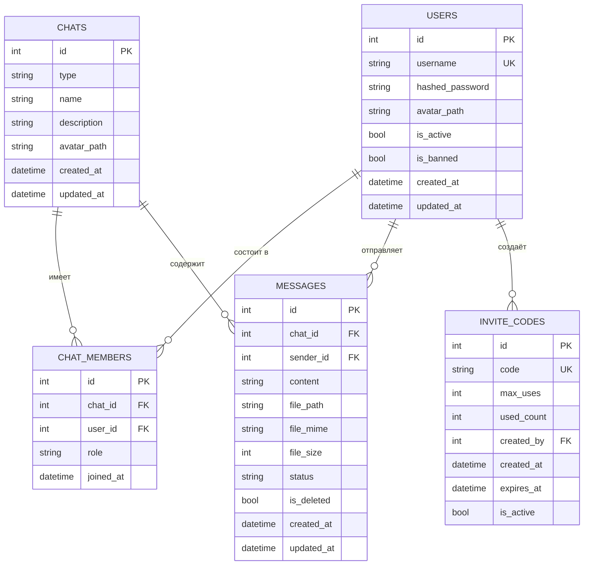
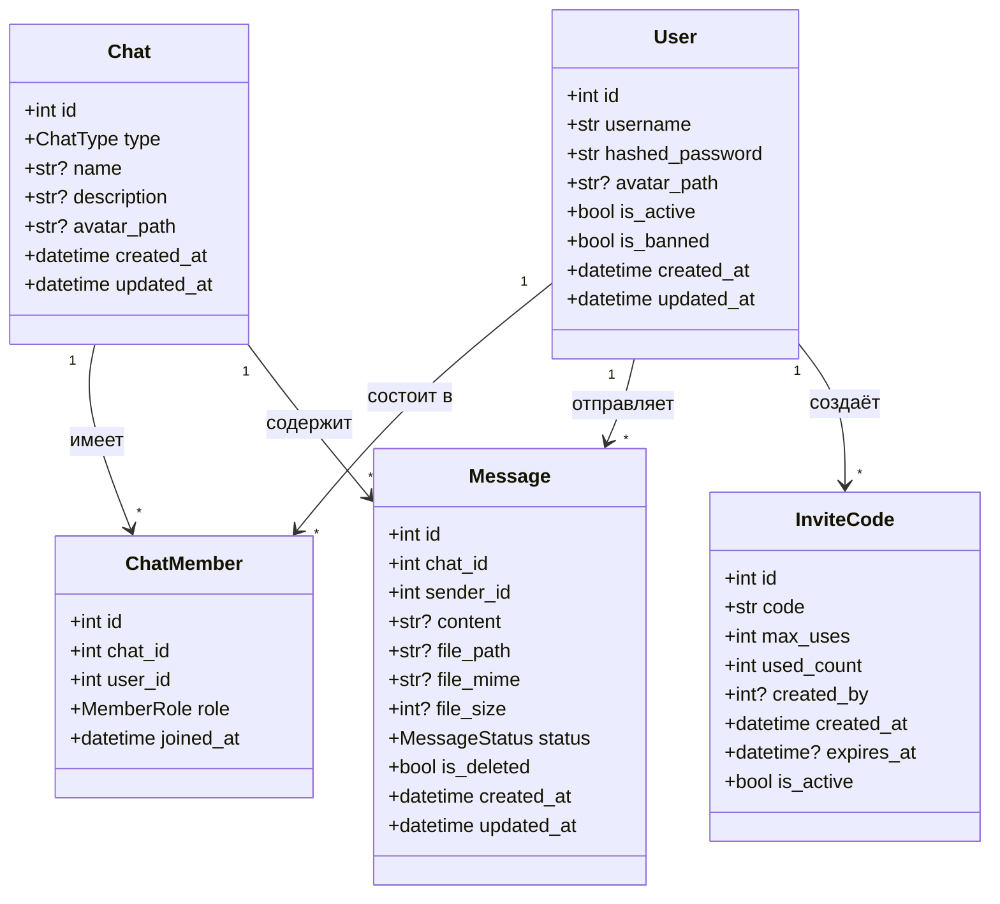

# 🗄️ База данных

## Обзор

- **СУБД:** SQLite 3
- **Режим журнала:** WAL (Write-Ahead Logging)
- **Синхронизация:** NORMAL
- **Внешние ключи:** Включены
- **ORM:** SQLModel (SQLAlchemy 2.0 + Pydantic)

## ER-диаграмма



## Модели

### User (users)

| Поле | Тип | Ограничения | По умолчанию | Описание |
|------|-----|-------------|--------------|----------|
| id | int | PK, autoincrement | — | Уникальный ID |
| username | str | UNIQUE, INDEX, 2-50 | — | Имя пользователя |
| hashed_password | str | NOT NULL, min 8 | — | Argon2id хеш |
| avatar_path | str\|None | max 500 | NULL | Путь к аватару |
| is_active | bool | NOT NULL | True | Активен ли |
| is_banned | bool | NOT NULL | False | Забанен ли |
| created_at | datetime | NOT NULL | utcnow | Дата создания |
| updated_at | datetime | NOT NULL | utcnow | Дата обновления |

### Chat (chats)

| Поле | Тип | Ограничения | По умолчанию | Описание |
|------|-----|-------------|--------------|----------|
| id | int | PK, autoincrement | — | Уникальный ID |
| type | ChatType | NOT NULL | personal | personal / group |
| name | str\|None | max 200 | NULL | Название |
| description | str\|None | max 1000 | NULL | Описание |
| avatar_path | str\|None | max 500 | NULL | Путь к аватару |
| created_at | datetime | NOT NULL | utcnow | Дата создания |
| updated_at | datetime | NOT NULL | utcnow | Последнее сообщение |

### ChatMember (chat_members)

| Поле | Тип | Ограничения | По умолчанию | Описание |
|------|-----|-------------|--------------|----------|
| id | int | PK, autoincrement | — | Уникальный ID |
| chat_id | int | FK→chats.id, INDEX | — | ID чата |
| user_id | int | FK→users.id, INDEX | — | ID пользователя |
| role | MemberRole | NOT NULL | member | admin / member |
| joined_at | datetime | NOT NULL | utcnow | Дата вступления |

### Message (messages)

| Поле | Тип | Ограничения | По умолчанию | Описание |
|------|-----|-------------|--------------|----------|
| id | int | PK, autoincrement | — | Уникальный ID |
| chat_id | int | FK→chats.id, INDEX | — | ID чата |
| sender_id | int | FK→users.id, INDEX | — | ID отправителя |
| content | str\|None | max 10000 | NULL | Текст сообщения |
| file_path | str\|None | max 500 | NULL | Путь к файлу |
| file_mime | str\|None | max 100 | NULL | MIME тип |
| file_size | int\|None | — | NULL | Размер (байты) |
| status | MessageStatus | NOT NULL | sent | sent/delivered/read |
| is_deleted | bool | NOT NULL | False | Soft delete |
| created_at | datetime | NOT NULL | utcnow | Дата создания |
| updated_at | datetime | NOT NULL | utcnow | Дата обновления |

### InviteCode (invite_codes)

| Поле | Тип | Ограничения | По умолчанию | Описание |
|------|-----|-------------|--------------|----------|
| id | int | PK, autoincrement | — | Уникальный ID |
| code | str | UNIQUE, INDEX, max 50 | — | Код (8 символов) |
| max_uses | int | NOT NULL | 1 | Макс. использований |
| used_count | int | NOT NULL | 0 | Текущее использование |
| created_by | int\|None | FK→users.id | NULL | ID создателя |
| created_at | datetime | NOT NULL | utcnow | Дата создания |
| expires_at | datetime\|None | — | NULL | Дата истечения |
| is_active | bool | NOT NULL | True | Активен ли |

## Диаграмма классов



## Перечисления

### ChatType
| Значение | Описание |
|----------|----------|
| `personal` | Личный чат (2 человека) |
| `group` | Групповой чат (до 20 человек) |

### MemberRole
| Значение | Права |
|----------|-------|
| `admin` | Полный контроль: удаление чата, управление участниками, удаление сообщений |
| `member` | Отправка и чтение сообщений |

### MessageStatus
| Значение | Описание |
|----------|----------|
| `sent` | Отправлено (сохранено в БД) |
| `delivered` | Доставлено (получатель онлайн) |
| `read` | Прочитано (получатель открыл чат) |

## Инициализация

```python
# messenger/database.py
async def init_db() -> None:
    DB_DIR.mkdir(parents=True, exist_ok=True)
    # WAL режим
    async with aiosqlite.connect(str(DB_FILE)) as db:
        await db.execute("PRAGMA journal_mode=WAL;")
        await db.execute("PRAGMA synchronous=NORMAL;")
        await db.execute("PRAGMA foreign_keys=ON;")
        await db.commit()
    # Создание таблиц
    engine = get_engine()
    async with engine.begin() as conn:
        await conn.run_sync(SQLModel.metadata.create_all)
```

## Бэкапы

```bash
make backup    # sqlite3 .backup
make restore BACKUP_FILE=./backups/app_2024-01-01.db.gz
```
