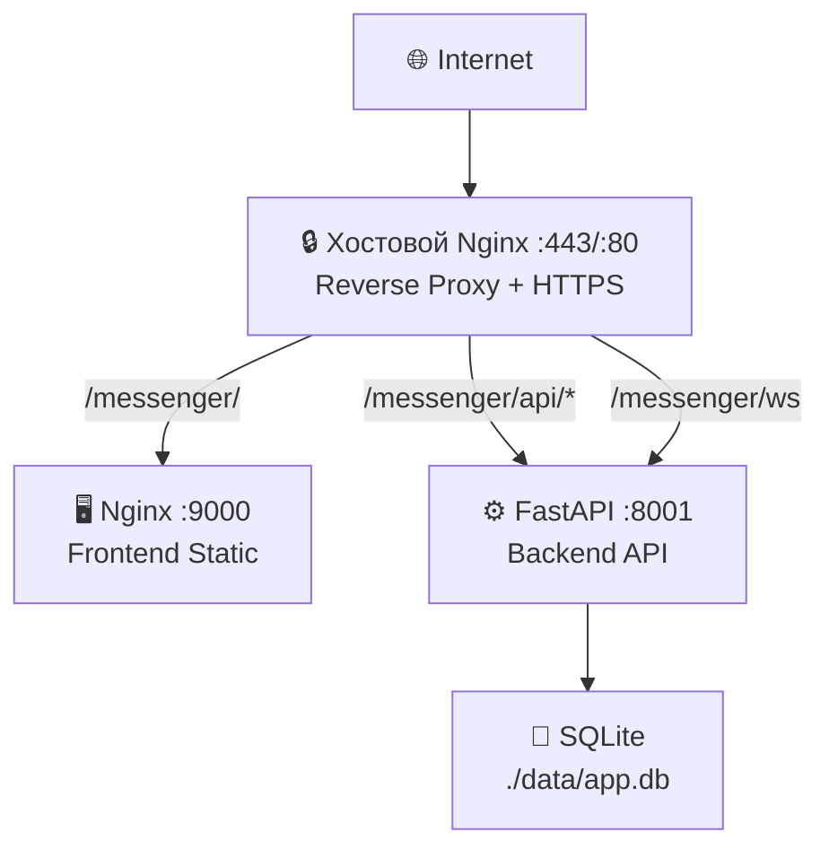

# 🚀 Развёртывание

## Docker Compose

### Архитектура развёртывания



> **Важно:** Frontend собирается с `base: '/messenger/'`, поэтому все пути начинаются с `/messenger/`.

### Сервисы

| Сервис | Образ | Порты | Описание |
|--------|-------|-------|----------|
| app | Custom | 8001 | Backend (FastAPI) |
| frontend | Custom (multi-stage) | 9000:80 | Frontend (Vue 3 PWA) |
| ~~proxy~~ | ~~caddy:2-alpine~~ | ~~80, 443~~ | Закомментирован — используется хостовой nginx |

> **Примечание:** Caddy закомментирован в `docker-compose.yml`. Для production используется хостовой nginx с SSL от Let's Encrypt. См. [nginx-host.md](nginx-host.md).

### Быстрый старт

```bash
cp .env.example .env
# Отредактируйте .env: JWT_SECRET_KEY, CORS_ORIGINS
make build    # Сборка без кеша
make up       # Запуск
```

### Переменные окружения

| Переменная | Тип | По умолчанию | Описание |
|------------|-----|--------------|----------|
| `APP_NAME` | string | Messenger | Название приложения |
| `DEBUG` | bool | false | Режим отладки |
| `LOG_LEVEL` | string | INFO | Уровень логирования |
| `DATABASE_URL` | string | sqlite+aiosqlite:///./data/app.db | URL БД |
| `JWT_SECRET_KEY` | string | **Обязательно** | Секретный ключ JWT |
| `JWT_ALGORITHM` | string | HS256 | Алгоритм JWT |
| `JWT_EXPIRE_MINUTES` | int | 10080 | Время жизни токена (7 дней) |
| `UPLOAD_DIR` | string | ./data/uploads | Директория файлов |
| `MAX_FILE_SIZE_MB` | int | 25 | Макс. размер файла |
| `RATE_LIMIT_REQUESTS` | int | 5 | Запросов в секунду |
| `CORS_ORIGINS` | string | http://localhost,... | CORS origins (через запятую) |

## Production

### Хостовой nginx

См. [nginx-host.md](nginx-host.md) — полная инструкция по настройке.

Кратко:
1. Добавьте location блоки в существующий server block
2. `sudo nginx -t && sudo systemctl reload nginx`
3. Запустите backend и frontend

### Бэкапы

```bash
make backup    # Создать бэкап
make restore BACKUP_FILE=./backups/app_2024-01-01.db.gz  # Восстановить
```

### Cron автобэкапов

```bash
# /etc/crontab
0 2 * * * /path/to/scripts/cron-backup.sh
```

## Локальная разработка

### Backend

```bash
poetry install
uvicorn messenger.main:app --reload --port 8000
```

### Frontend

```bash
cd frontend
npm install
npm run dev  # http://localhost:5173
```

### Тесты

```bash
make test       # Запуск тестов
make test-cov   # С coverage
make lint       # Линтинг
make format     # Форматирование
```

## Troubleshooting

### CORS ошибки

Проверьте `CORS_ORIGINS` в `.env` — должен содержать ваш домен/IP.

### JWT ошибки

Убедитесь что `JWT_SECRET_KEY` установлен и не пустой.

### Permission denied

Проверьте права на `./data` — должен быть доступен контейнеру.

### Порт занят

Измените маппинг в `docker-compose.yml`:
```yaml
frontend:
  ports:
    - "9001:80"  # вместо 9000
```
